# AI Engineer GPT Specialist - Interview Preparation Guide

## Table of Contents
1. [LLM Fundamentals & Model Comparison](#llm-fundamentals--model-comparison)
2. [GPT Architecture & Implementation](#gpt-architecture--implementation)
3. [RAG (Retrieval-Augmented Generation)](#rag-retrieval-augmented-generation)
4. [Prompt Engineering](#prompt-engineering)
5. [AI Agents & Agentic AI](#ai-agents--agentic-ai)
6. [MCP (Model Context Protocol)](#mcp-model-context-protocol)
7. [Fine-tuning & Model Training](#fine-tuning--model-training)
8. [Evaluation Metrics](#evaluation-metrics)
9. [Cloud & AWS Integration](#cloud--aws-integration)
10. [System Design & Architecture](#system-design--architecture)
11. [Performance & Optimization](#performance--optimization)
12. [Security & Best Practices](#security--best-practices)

---

## LLM Fundamentals & Model Comparison

### 1. Which LLM is the best and most scalable? Compare GPT, LLaMA, Claude, Anthropic, Gemma, Grok, Perplexity.

**Answer:**
- **GPT-4o**: Best overall performance, excellent reasoning, multimodal
- **Claude 3.5 Sonnet**: Best for long context, safety, and complex reasoning
- **LLaMA 2/3**: Best for open-source, cost-effective, customizable
- **Gemma**: Google's efficient, smaller models for edge deployment
- **Grok**: Real-time data access, good for current events
- **Perplexity**: Best for research and fact-checking with citations

**Scalability Ranking:**
1. LLaMA (open-source, self-hosted)
2. GPT-4o (API-based, enterprise support)
3. Claude (safety-focused, long context)
4. Gemma (efficient, Google infrastructure)

### 2. What are the key differences between transformer architectures in different LLMs?

**Answer:**
- **GPT**: Decoder-only, autoregressive, next-token prediction
- **BERT**: Encoder-only, bidirectional, masked language modeling
- **T5**: Encoder-decoder, text-to-text transfer
- **PaLM**: Decoder-only with improved attention mechanisms
- **LLaMA**: Decoder-only with RMSNorm and SwiGLU activation

### 3. Explain the concept of attention mechanisms in LLMs.

**Answer:**
```python
# Simplified attention mechanism
def attention(Q, K, V):
    scores = Q @ K.T / sqrt(d_k)
    weights = softmax(scores)
    output = weights @ V
    return output
```

**Key Points:**
- Self-attention allows tokens to attend to all positions
- Multi-head attention captures different types of relationships
- Scaled dot-product attention prevents vanishing gradients

### 4. What is the difference between pre-training, fine-tuning, and prompt engineering?

**Answer:**
- **Pre-training**: Learning general language patterns on large datasets
- **Fine-tuning**: Adapting pre-trained model to specific tasks
- **Prompt Engineering**: Crafting inputs to get desired outputs without training

### 5. How do you choose between different GPT models for production?

**Answer:**
- **GPT-4o**: Complex reasoning, high accuracy requirements
- **GPT-4o Mini**: Cost-sensitive applications, good performance
- **GPT-3.5 Turbo**: Fast responses, simple tasks
- **GPT-4 Turbo**: Long context, detailed analysis

---

## GPT Architecture & Implementation

### 6. Explain the GPT tokenization process.

**Answer:**
```python
# BPE (Byte Pair Encoding) process
def tokenize(text):
    # 1. Split into characters
    chars = list(text)
    # 2. Apply BPE merges
    tokens = apply_bpe_merges(chars)
    # 3. Map to token IDs
    token_ids = [vocab[token] for token in tokens]
    return token_ids
```

### 7. What are the key components of a GPT model?

**Answer:**
- **Embedding Layer**: Converts tokens to vectors
- **Positional Encoding**: Adds position information
- **Transformer Blocks**: Multi-head attention + feed-forward
- **Layer Normalization**: Stabilizes training
- **Output Head**: Maps to vocabulary probabilities

### 8. How does temperature affect GPT output?

**Answer:**
```python
# Temperature scaling
def apply_temperature(logits, temperature):
    return logits / temperature

# Higher temperature = more random
# Lower temperature = more deterministic
```

### 9. What is the difference between top-p and top-k sampling?

**Answer:**
- **Top-k**: Select from k most likely tokens
- **Top-p (nucleus)**: Select from tokens whose cumulative probability ≤ p
- **Top-p is more adaptive** to context

### 10. How do you handle context length limitations in GPT?

**Answer:**
- **Chunking**: Split long documents into smaller pieces
- **Summarization**: Create summaries of previous context
- **Sliding Window**: Keep only recent context
- **Hierarchical**: Use different models for different context lengths

---

## RAG (Retrieval-Augmented Generation)

### 11. What is RAG and why is it important?

**Answer:**
RAG combines retrieval (finding relevant information) with generation (creating responses).

**Benefits:**
- Reduces hallucinations
- Provides up-to-date information
- Enables domain-specific knowledge
- Improves accuracy and reliability

### 12. Explain the RAG pipeline architecture.

**Answer:**
```python
def rag_pipeline(query, documents):
    # 1. Document Processing
    chunks = chunk_documents(documents)
    
    # 2. Embedding Generation
    doc_embeddings = embed_documents(chunks)
    query_embedding = embed_query(query)
    
    # 3. Retrieval
    relevant_chunks = retrieve_similar(query_embedding, doc_embeddings)
    
    # 4. Generation
    context = format_context(relevant_chunks)
    response = generate_response(query, context)
    
    return response
```

### 13. What are the best chunking strategies for RAG?

**Answer:**
- **Fixed-size chunks**: Simple, consistent
- **Semantic chunking**: Based on meaning boundaries
- **Overlapping chunks**: Prevents information loss
- **Hierarchical chunking**: Multiple granularities

### 14. How do you choose the right similarity algorithm for RAG?

**Answer:**
- **Cosine Similarity**: Most common, good for high-dimensional vectors
- **Dot Product**: Faster, good for normalized embeddings
- **Euclidean Distance**: Good for dense vectors
- **Manhattan Distance**: Robust to outliers

### 15. What are the challenges with RAG systems?

**Answer:**
- **Retrieval Quality**: Finding relevant information
- **Context Length**: Fitting retrieved content in context window
- **Latency**: Multiple API calls increase response time
- **Cost**: Embedding and retrieval add expenses

### 16. How do you evaluate RAG system performance?

**Answer:**
- **Retrieval Metrics**: Precision, Recall, MRR
- **Generation Metrics**: BLEU, ROUGE, BERTScore
- **End-to-end Metrics**: Human evaluation, task-specific metrics
- **Latency**: Response time, throughput

---

## Prompt Engineering

### 17. What is prompt engineering and why is it important?

**Answer:**
Prompt engineering is the art of crafting inputs to get desired outputs from LLMs.

**Key Principles:**
- Be specific and clear
- Provide examples (few-shot learning)
- Use role-based prompting
- Iterate and test

### 18. Explain different types of prompting techniques.

**Answer:**
- **Zero-shot**: Direct question without examples
- **Few-shot**: Provide examples in the prompt
- **Chain-of-thought**: Ask model to show reasoning
- **Role-based**: Assign specific roles to the model
- **Template-based**: Use structured prompt templates

### 19. How do you handle prompt injection attacks?

**Answer:**
- **Input Validation**: Sanitize user inputs
- **Prompt Separation**: Use system/user message separation
- **Output Filtering**: Check outputs for malicious content
- **Rate Limiting**: Prevent abuse

### 20. What is the difference between system and user prompts?

**Answer:**
- **System Prompt**: Sets behavior, role, and constraints
- **User Prompt**: Contains the actual request or question
- **Separation**: Prevents prompt injection and improves control

---

## AI Agents & Agentic AI

### 21. What is the difference between AI Agents and traditional function calling?

**Answer:**
- **Function Calling**: Static, predetermined steps
- **AI Agents**: Dynamic decision-making, autonomous behavior
- **Agents**: Can reason, plan, and adapt to situations

### 22. Explain the agent architecture in your GURU_GPT project.

**Answer:**
```python
class AIAgent:
    def __init__(self):
        self.tools = [WeatherTool(), NewsTool(), CalculatorTool()]
        self.memory = ConversationMemory()
        self.planning = PlanningModule()
    
    def execute(self, query):
        # 1. Understand intent
        intent = self.understand_intent(query)
        
        # 2. Plan execution
        plan = self.planning.create_plan(intent)
        
        # 3. Execute tools
        results = self.execute_tools(plan)
        
        # 4. Generate response
        response = self.generate_response(results)
        
        return response
```

### 23. What are the key components of an AI agent system?

**Answer:**
- **Perception**: Understanding input
- **Reasoning**: Planning and decision-making
- **Action**: Executing tools and functions
- **Memory**: Storing and retrieving information
- **Learning**: Adapting from experience

### 24. How do you handle agent failures and error recovery?

**Answer:**
- **Retry Logic**: Attempt operations multiple times
- **Fallback Strategies**: Alternative approaches when primary fails
- **Error Handling**: Graceful degradation
- **User Feedback**: Learn from user corrections

### 25. What is the difference between reactive and proactive agents?

**Answer:**
- **Reactive**: Respond to immediate stimuli
- **Proactive**: Anticipate needs and take initiative
- **Hybrid**: Combine both approaches

---

## MCP (Model Context Protocol)

### 26. What is MCP and why is it important?

**Answer:**
MCP is a protocol for AI models to interact with external tools and data sources.

**Benefits:**
- Standardized communication
- Tool discovery and calling
- Resource management
- Cross-platform compatibility

### 27. Explain the MCP server architecture.

**Answer:**
```python
class MCPServer:
    def __init__(self):
        self.tools = {}
        self.resources = {}
        self.prompts = {}
    
    def handle_request(self, method, params):
        if method == "tools/list":
            return self.list_tools()
        elif method == "tools/call":
            return self.call_tool(params)
        elif method == "resources/read":
            return self.read_resource(params)
```

### 28. What are the key MCP methods and their purposes?

**Answer:**
- **initialize**: Establish connection
- **tools/list**: Discover available tools
- **tools/call**: Execute specific tools
- **resources/list**: List available resources
- **resources/read**: Access resource content
- **prompts/list**: Get available prompts

### 29. How do you implement tool discovery in MCP?

**Answer:**
```python
def list_tools(self):
    return {
        "tools": [
            {
                "name": "get_weather",
                "description": "Get current weather",
                "inputSchema": {
                    "type": "object",
                    "properties": {
                        "location": {"type": "string"}
                    }
                }
            }
        ]
    }
```

### 30. What are the security considerations for MCP servers?

**Answer:**
- **Input Validation**: Sanitize all inputs
- **Rate Limiting**: Prevent abuse
- **Authentication**: Verify client identity
- **Resource Limits**: Control resource usage

---

## Fine-tuning & Model Training

### 31. What is fine-tuning and when should you use it?

**Answer:**
Fine-tuning adapts pre-trained models to specific tasks or domains.

**When to use:**
- Domain-specific tasks
- Consistent output format
- Performance optimization
- Cost reduction

### 32. Explain the fine-tuning process for sentiment analysis.

**Answer:**
```python
def fine_tune_sentiment_model():
    # 1. Load pre-trained model
    model = DistilBertForSequenceClassification.from_pretrained('distilbert-base-uncased')
    
    # 2. Prepare data
    train_loader = create_data_loader(train_data)
    
    # 3. Setup training
    optimizer = AdamW(model.parameters(), lr=2e-5)
    scheduler = get_linear_schedule_with_warmup(optimizer, num_warmup_steps=0, num_training_steps=total_steps)
    
    # 4. Training loop
    for epoch in range(epochs):
        for batch in train_loader:
            outputs = model(**batch)
            loss = outputs.loss
            loss.backward()
            optimizer.step()
            scheduler.step()
```

### 33. What is the difference between full fine-tuning and LoRA?

**Answer:**
- **Full Fine-tuning**: Updates all model parameters
- **LoRA**: Updates only low-rank adaptation matrices
- **LoRA**: Faster, less memory, good performance

### 34. How do you prevent overfitting in fine-tuning?

**Answer:**
- **Early Stopping**: Monitor validation loss
- **Learning Rate Scheduling**: Reduce LR over time
- **Regularization**: Dropout, weight decay
- **Data Augmentation**: Increase training data diversity

### 35. What are the evaluation metrics for fine-tuned models?

**Answer:**
- **Accuracy**: Correct predictions / total predictions
- **F1-Score**: Harmonic mean of precision and recall
- **Precision**: True positives / (True positives + False positives)
- **Recall**: True positives / (True positives + False negatives)

---

## Evaluation Metrics

### 36. What are the key LLM evaluation metrics?

**Answer:**
- **Perplexity**: Model's uncertainty about next token
- **BLEU**: N-gram overlap with reference
- **ROUGE**: Recall-oriented evaluation
- **BERTScore**: Semantic similarity using BERT
- **Human Evaluation**: Gold standard but expensive

### 37. How do you evaluate RAG system performance?

**Answer:**
- **Retrieval Metrics**: Precision@k, Recall@k, MRR
- **Generation Metrics**: BLEU, ROUGE, BERTScore
- **End-to-end Metrics**: Task-specific accuracy
- **Latency**: Response time, throughput

### 38. What is the difference between automatic and human evaluation?

**Answer:**
- **Automatic**: Fast, cheap, objective but limited
- **Human**: Slow, expensive, subjective but comprehensive
- **Hybrid**: Combine both approaches

### 39. How do you measure model bias and fairness?

**Answer:**
- **Demographic Parity**: Equal outcomes across groups
- **Equalized Odds**: Equal true/false positive rates
- **Calibration**: Predicted probabilities match actual frequencies
- **Bias Testing**: Systematic evaluation across demographics

### 40. What are the challenges in LLM evaluation?

**Answer:**
- **Reference Quality**: Need high-quality ground truth
- **Metric Limitations**: No single metric captures everything
- **Context Sensitivity**: Performance varies with context
- **Scalability**: Evaluating large models is expensive

---

## Cloud & AWS Integration

### 41. What is AWS Bedrock and how does it work?

**Answer:**
AWS Bedrock is a fully managed service for foundation models.

**Key Features:**
- Access to multiple LLMs (Claude, Llama, Titan)
- Serverless inference
- Fine-tuning capabilities
- Enterprise security

### 42. How do you optimize costs in AWS Bedrock?

**Answer:**
- **Model Selection**: Choose appropriate model for task
- **Caching**: Cache frequent responses
- **Batch Processing**: Process multiple requests together
- **Monitoring**: Track usage and costs

### 43. What are the security considerations for cloud LLM deployment?

**Answer:**
- **Data Encryption**: Encrypt data in transit and at rest
- **Access Control**: IAM roles and policies
- **Network Security**: VPC, security groups
- **Compliance**: GDPR, HIPAA, SOC 2

### 44. How do you handle model versioning in production?

**Answer:**
- **A/B Testing**: Compare model versions
- **Blue-Green Deployment**: Zero-downtime updates
- **Feature Flags**: Control model selection
- **Rollback Strategy**: Quick reversion if needed

### 45. What are the benefits of using managed LLM services?

**Answer:**
- **Scalability**: Automatic scaling
- **Reliability**: High availability
- **Security**: Enterprise-grade security
- **Cost**: Pay-per-use pricing

---

## System Design & Architecture

### 46. How would you design a scalable LLM application?

**Answer:**
```python
# High-level architecture
class LLMApplication:
    def __init__(self):
        self.api_gateway = APIGateway()
        self.load_balancer = LoadBalancer()
        self.llm_service = LLMService()
        self.cache = RedisCache()
        self.database = PostgreSQL()
        self.monitoring = MonitoringService()
```

### 47. What are the key components of a production LLM system?

**Answer:**
- **API Gateway**: Request routing and rate limiting
- **Load Balancer**: Distribute traffic
- **LLM Service**: Core model inference
- **Cache**: Store frequent responses
- **Database**: Store conversations and metadata
- **Monitoring**: Track performance and errors

### 48. How do you handle high availability in LLM systems?

**Answer:**
- **Multi-region Deployment**: Geographic distribution
- **Circuit Breakers**: Prevent cascade failures
- **Health Checks**: Monitor service health
- **Auto-scaling**: Adjust capacity based on demand

### 49. What is the difference between synchronous and asynchronous LLM processing?

**Answer:**
- **Synchronous**: Immediate response, blocking
- **Asynchronous**: Non-blocking, callback-based
- **Use Cases**: Sync for real-time, async for batch processing

### 50. How do you implement rate limiting for LLM APIs?

**Answer:**
```python
def rate_limit(user_id, request_count):
    # Token bucket algorithm
    tokens = get_user_tokens(user_id)
    if tokens >= request_count:
        consume_tokens(user_id, request_count)
        return True
    return False
```

---

## Performance & Optimization

### 51. How do you optimize LLM response time?

**Answer:**
- **Caching**: Store frequent responses
- **Model Selection**: Use faster models for simple tasks
- **Batch Processing**: Process multiple requests together
- **CDN**: Distribute content globally

### 52. What are the memory optimization techniques for LLMs?

**Answer:**
- **Quantization**: Reduce precision (FP16, INT8)
- **Pruning**: Remove unnecessary parameters
- **Knowledge Distillation**: Train smaller models
- **Gradient Checkpointing**: Trade compute for memory

### 53. How do you handle token limits in production?

**Answer:**
- **Chunking**: Split long inputs
- **Summarization**: Compress context
- **Sliding Window**: Keep recent context
- **Hierarchical**: Use different models for different lengths

### 54. What is the difference between throughput and latency?

**Answer:**
- **Latency**: Time for single request
- **Throughput**: Requests per second
- **Trade-off**: Higher throughput often means higher latency

### 55. How do you monitor LLM performance in production?

**Answer:**
- **Metrics**: Response time, error rate, token usage
- **Logging**: Request/response logs
- **Alerting**: Set up alerts for anomalies
- **Dashboards**: Visualize performance data

---

## Security & Best Practices

### 56. What are the main security risks in LLM applications?

**Answer:**
- **Prompt Injection**: Malicious inputs
- **Data Leakage**: Sensitive information exposure
- **Model Poisoning**: Adversarial training data
- **API Abuse**: Unauthorized usage

### 57. How do you prevent prompt injection attacks?

**Answer:**
- **Input Validation**: Sanitize user inputs
- **Prompt Separation**: Use system/user messages
- **Output Filtering**: Check responses for malicious content
- **Rate Limiting**: Prevent abuse

### 58. What are the data privacy considerations for LLMs?

**Answer:**
- **Data Minimization**: Collect only necessary data
- **Encryption**: Encrypt sensitive data
- **Access Control**: Limit data access
- **Retention**: Delete data when no longer needed

### 59. How do you ensure model fairness and bias mitigation?

**Answer:**
- **Diverse Training Data**: Include diverse examples
- **Bias Testing**: Evaluate across demographics
- **Fairness Metrics**: Monitor for bias
- **Regular Audits**: Periodic bias assessments

### 60. What are the best practices for LLM deployment?

**Answer:**
- **Version Control**: Track model versions
- **Testing**: Comprehensive testing before deployment
- **Monitoring**: Continuous performance monitoring
- **Documentation**: Clear documentation and runbooks

---

## Advanced Topics

### 61. What is the difference between few-shot and zero-shot learning?

**Answer:**
- **Zero-shot**: No examples provided
- **Few-shot**: Few examples provided
- **Many-shot**: Many examples provided
- **Fine-tuning**: Extensive training on task-specific data

### 62. How do you handle multimodal inputs in LLMs?

**Answer:**
- **Vision-Language Models**: Process images and text
- **Audio Processing**: Convert speech to text
- **Embedding Fusion**: Combine different modalities
- **Cross-modal Attention**: Attend across modalities

### 63. What is the role of reinforcement learning in LLMs?

**Answer:**
- **RLHF**: Reinforcement Learning from Human Feedback
- **Reward Modeling**: Learn human preferences
- **Policy Optimization**: Improve model behavior
- **Alignment**: Align with human values

### 64. How do you implement function calling in LLMs?

**Answer:**
```python
def function_calling_example():
    # 1. Define available functions
    functions = [
        {
            "name": "get_weather",
            "description": "Get current weather",
            "parameters": {
                "type": "object",
                "properties": {
                    "location": {"type": "string"}
                }
            }
        }
    ]
    
    # 2. Include in prompt
    response = llm.generate(
        prompt=user_query,
        functions=functions
    )
    
    # 3. Parse function call
    if response.function_call:
        result = execute_function(response.function_call)
        return result
```

### 65. What are the challenges with long-context LLMs?

**Answer:**
- **Computational Cost**: Quadratic scaling with context length
- **Memory Usage**: High memory requirements
- **Attention Patterns**: Difficulty attending to distant tokens
- **Quality Degradation**: Performance drops with very long contexts

### 66. How do you implement memory in conversational AI?

**Answer:**
- **Short-term Memory**: Current conversation context
- **Long-term Memory**: Persistent user information
- **Episodic Memory**: Specific conversation episodes
- **Semantic Memory**: General knowledge and facts

### 67. What is the difference between retrieval and generation in RAG?

**Answer:**
- **Retrieval**: Finding relevant information
- **Generation**: Creating responses based on retrieved information
- **Balance**: Too much retrieval can overwhelm generation
- **Quality**: Both components affect final output quality

### 68. How do you handle hallucinations in LLMs?

**Answer:**
- **RAG**: Provide factual context
- **Prompting**: Ask for citations and sources
- **Post-processing**: Verify facts with external sources
- **Training**: Use fact-checked training data

### 69. What are the ethical considerations in LLM development?

**Answer:**
- **Bias and Fairness**: Ensure equitable outcomes
- **Transparency**: Explain model decisions
- **Privacy**: Protect user data
- **Accountability**: Take responsibility for model outputs

### 70. How do you implement cost optimization in LLM applications?

**Answer:**
- **Model Selection**: Choose appropriate model for task
- **Caching**: Store frequent responses
- **Batch Processing**: Process multiple requests together
- **Monitoring**: Track usage and costs

---

## System Integration & APIs

### 71. How do you design RESTful APIs for LLM services?

**Answer:**
```python
# API Design Example
@app.post("/api/v1/chat")
def chat_endpoint(request: ChatRequest):
    # Validate input
    if not request.message:
        raise HTTPException(400, "Message required")
    
    # Process request
    response = llm_service.generate_response(
        message=request.message,
        context=request.context,
        model=request.model
    )
    
    # Return response
    return ChatResponse(
        message=response.text,
        tokens_used=response.tokens,
        cost=response.cost
    )
```

### 72. What are the key considerations for LLM API design?

**Answer:**
- **Input Validation**: Validate all inputs
- **Rate Limiting**: Prevent abuse
- **Error Handling**: Graceful error responses
- **Documentation**: Clear API documentation

### 73. How do you implement streaming responses for LLMs?

**Answer:**
```python
def stream_response(prompt):
    for chunk in llm.stream_generate(prompt):
        yield f"data: {chunk}\n\n"
    yield "data: [DONE]\n\n"
```

### 74. What is the difference between REST and GraphQL for LLM APIs?

**Answer:**
- **REST**: Simple, cacheable, stateless
- **GraphQL**: Flexible queries, single endpoint
- **LLM APIs**: REST is more common for simplicity

### 75. How do you handle API versioning for LLM services?

**Answer:**
- **URL Versioning**: /api/v1/, /api/v2/
- **Header Versioning**: Accept: application/vnd.api+json;version=1
- **Query Parameter**: ?version=1
- **Content Negotiation**: Accept header with version

---

## Testing & Quality Assurance

### 76. How do you test LLM applications?

**Answer:**
- **Unit Tests**: Test individual components
- **Integration Tests**: Test API endpoints
- **End-to-end Tests**: Test complete workflows
- **Performance Tests**: Test under load

### 77. What are the challenges in testing LLM applications?

**Answer:**
- **Non-deterministic Outputs**: Responses vary
- **Quality Assessment**: Subjective evaluation
- **Cost**: Testing can be expensive
- **Data Privacy**: Sensitive test data

### 78. How do you implement automated testing for LLMs?

**Answer:**
```python
def test_llm_response():
    # Test with known inputs
    test_cases = [
        ("What is 2+2?", "4"),
        ("Capital of France?", "Paris")
    ]
    
    for input_text, expected in test_cases:
        response = llm.generate(input_text)
        assert expected.lower() in response.lower()
```

### 79. What are the key metrics for LLM quality assurance?

**Answer:**
- **Accuracy**: Correct responses
- **Consistency**: Similar inputs produce similar outputs
- **Latency**: Response time
- **Cost**: Token usage and costs

### 80. How do you handle A/B testing for LLM models?

**Answer:**
- **Traffic Splitting**: Route percentage of traffic to each model
- **Metrics Comparison**: Compare performance metrics
- **Statistical Significance**: Ensure results are meaningful
- **Rollback Plan**: Quick reversion if needed

---

## Deployment & DevOps

### 81. How do you deploy LLM applications to production?

**Answer:**
- **Containerization**: Docker containers
- **Orchestration**: Kubernetes for scaling
- **CI/CD**: Automated deployment pipeline
- **Monitoring**: Health checks and metrics

### 82. What are the key considerations for LLM deployment?

**Answer:**
- **Scalability**: Handle varying loads
- **Reliability**: High availability
- **Security**: Protect data and APIs
- **Cost**: Optimize resource usage

### 83. How do you implement blue-green deployment for LLMs?

**Answer:**
- **Blue Environment**: Current production
- **Green Environment**: New version
- **Traffic Switching**: Gradually shift traffic
- **Rollback**: Quick reversion if issues

### 84. What are the monitoring requirements for LLM applications?

**Answer:**
- **Health Checks**: Service availability
- **Performance Metrics**: Response time, throughput
- **Error Tracking**: Log and alert on errors
- **Cost Monitoring**: Track token usage and costs

### 85. How do you handle secrets management in LLM applications?

**Answer:**
- **Environment Variables**: Store API keys
- **Secret Management**: AWS Secrets Manager, Azure Key Vault
- **Encryption**: Encrypt secrets at rest
- **Access Control**: Limit secret access

---

## Troubleshooting & Debugging

### 86. How do you debug LLM application issues?

**Answer:**
- **Logging**: Comprehensive logging
- **Tracing**: Request tracing across services
- **Metrics**: Monitor key performance indicators
- **Error Analysis**: Analyze error patterns

### 87. What are the common issues in LLM applications?

**Answer:**
- **Rate Limiting**: API rate limits exceeded
- **Token Limits**: Context too long
- **Poor Quality**: Inconsistent responses
- **High Latency**: Slow response times

### 88. How do you handle LLM API failures?

**Answer:**
- **Retry Logic**: Exponential backoff
- **Circuit Breakers**: Prevent cascade failures
- **Fallback Models**: Use alternative models
- **Graceful Degradation**: Provide partial responses

### 89. What are the debugging tools for LLM applications?

**Answer:**
- **Logging**: Structured logging
- **APM**: Application Performance Monitoring
- **Tracing**: Distributed tracing
- **Profiling**: Performance profiling

### 90. How do you optimize LLM application performance?

**Answer:**
- **Caching**: Cache frequent responses
- **Batch Processing**: Process multiple requests
- **Model Selection**: Choose appropriate models
- **Resource Optimization**: Optimize compute resources

---

## Future Trends & Emerging Technologies

### 91. What are the emerging trends in LLM technology?

**Answer:**
- **Multimodal Models**: Vision, audio, text integration
- **Longer Context**: Extended context windows
- **Efficiency**: Smaller, faster models
- **Specialization**: Domain-specific models

### 92. How do you prepare for future LLM developments?

**Answer:**
- **Modular Architecture**: Flexible, adaptable design
- **API Abstraction**: Abstract model-specific details
- **Continuous Learning**: Stay updated with trends
- **Experimentation**: Test new models and techniques

### 93. What is the role of edge computing in LLM deployment?

**Answer:**
- **Latency Reduction**: Faster local processing
- **Privacy**: Data stays on device
- **Cost**: Reduced cloud costs
- **Offline Capability**: Works without internet

### 94. How do you handle model updates and migrations?

**Answer:**
- **Versioning**: Track model versions
- **A/B Testing**: Compare old and new models
- **Gradual Rollout**: Phased deployment
- **Rollback Strategy**: Quick reversion if needed

### 95. What are the implications of open-source LLMs?

**Answer:**
- **Cost Reduction**: No API fees
- **Customization**: Full control over models
- **Privacy**: Data stays on-premises
- **Complexity**: More infrastructure management

---

## Case Studies & Real-World Applications

### 96. How would you design a customer service chatbot?

**Answer:**
```python
class CustomerServiceBot:
    def __init__(self):
        self.knowledge_base = KnowledgeBase()
        self.intent_classifier = IntentClassifier()
        self.response_generator = ResponseGenerator()
    
    def handle_query(self, user_query):
        # 1. Classify intent
        intent = self.intent_classifier.classify(user_query)
        
        # 2. Retrieve relevant information
        context = self.knowledge_base.retrieve(intent)
        
        # 3. Generate response
        response = self.response_generator.generate(
            query=user_query,
            intent=intent,
            context=context
        )
        
        return response
```

### 97. How would you implement a document analysis system?

**Answer:**
- **Document Processing**: PDF, Word, text extraction
- **Chunking**: Split documents into manageable pieces
- **Embedding**: Create vector representations
- **Retrieval**: Find relevant chunks for queries
- **Generation**: Create responses based on retrieved content

### 98. How would you build a code generation assistant?

**Answer:**
- **Code Understanding**: Parse and understand code context
- **Prompt Engineering**: Craft effective prompts for code generation
- **Validation**: Check generated code for syntax and logic
- **Integration**: Integrate with development tools

### 99. How would you implement a multilingual LLM application?

**Answer:**
- **Language Detection**: Identify input language
- **Translation**: Translate to/from target language
- **Model Selection**: Choose appropriate model for language
- **Response Localization**: Format responses for target locale

### 100. How would you design a real-time LLM application?

**Answer:**
- **Streaming**: Real-time response streaming
- **WebSockets**: Bidirectional communication
- **Caching**: Cache frequent responses
- **Load Balancing**: Distribute real-time traffic

---

## GPT Parameters & Configuration

### 101. GPT Parameters - Default, Range, Meaning, Technicality

**Answer:**

#### a. Temperature
- **Default**: 1.0
- **Range**: 0.0 to 2.0
- **Meaning**: Controls randomness in output generation
- **Technical Details**:
  ```python
  # Temperature scaling formula
  scaled_logits = logits / temperature
  probabilities = softmax(scaled_logits)
  ```
- **Low (0.1-0.3)**: More deterministic, focused responses
- **Medium (0.7-1.0)**: Balanced creativity and consistency
- **High (1.2-2.0)**: More creative, diverse responses

#### b. Top-k
- **Default**: 50
- **Range**: 1 to 1000
- **Meaning**: Limits sampling to k most likely tokens
- **Technical Details**:
  ```python
  def top_k_sampling(logits, k):
      top_k_logits, top_k_indices = torch.topk(logits, k)
      probabilities = softmax(top_k_logits)
      return sample_from_distribution(probabilities, top_k_indices)
  ```
- **Low (1-10)**: Very focused, predictable
- **Medium (20-50)**: Balanced selection
- **High (100-1000)**: More diverse vocabulary

#### c. Top-p (Nucleus Sampling)
- **Default**: 1.0
- **Range**: 0.0 to 1.0
- **Meaning**: Dynamic token selection based on cumulative probability
- **Technical Details**:
  ```python
  def top_p_sampling(logits, p):
      sorted_logits, sorted_indices = torch.sort(logits, descending=True)
      cumulative_probs = torch.cumsum(softmax(sorted_logits), dim=-1)
      cutoff = torch.sum(cumulative_probs <= p)
      return sample_from_top_tokens(sorted_logits[:cutoff], sorted_indices[:cutoff])
  ```
- **Low (0.1-0.3)**: Very focused responses
- **Medium (0.7-0.9)**: Balanced creativity
- **High (0.95-1.0)**: Maximum diversity

### 102. Different Latest GPT Models and Their Purpose

**Answer:**

#### Text Generation Models
- **GPT-4o**: Latest multimodal model, best reasoning, vision capabilities
- **GPT-4o Mini**: Cost-effective version of GPT-4o, good performance
- **GPT-4 Turbo**: Long context (128k tokens), detailed analysis
- **GPT-3.5 Turbo**: Fast, cost-effective for simple tasks

#### Specialized Models
- **GPT-4 Vision**: Image analysis and description
- **GPT-4 Code**: Code generation and debugging
- **GPT-4 Function Calling**: Tool and function integration

#### Model Comparison
| Model | Context Length | Best For | Cost |
|-------|---------------|----------|------|
| GPT-4o | 128k | Complex reasoning, multimodal | High |
| GPT-4o Mini | 128k | Cost-sensitive applications | Medium |
| GPT-4 Turbo | 128k | Long documents, analysis | High |
| GPT-3.5 Turbo | 16k | Simple tasks, fast responses | Low |

### 103. GPT Models Context Length, Input Output Token Limits

**Answer:**

#### Context Length Limits
- **GPT-4o**: 128,000 tokens
- **GPT-4o Mini**: 128,000 tokens
- **GPT-4 Turbo**: 128,000 tokens
- **GPT-3.5 Turbo**: 16,000 tokens

#### Token Usage Guidelines
```python
# Token counting example
def estimate_tokens(text):
    # Rough estimation: 1 token ≈ 4 characters
    return len(text) // 4

# Context management
def manage_context(messages, max_tokens=120000):
    total_tokens = sum(estimate_tokens(msg) for msg in messages)
    if total_tokens > max_tokens:
        # Remove oldest messages to fit within limit
        while total_tokens > max_tokens and len(messages) > 1:
            removed = messages.pop(0)
            total_tokens -= estimate_tokens(removed)
    return messages
```

#### Input/Output Considerations
- **Input**: System prompt + user messages + conversation history
- **Output**: Generated response (typically 100-2000 tokens)
- **Reserve**: Leave 10-20% buffer for output generation
- **Chunking**: Split long documents into manageable pieces

### 104. 3 Ways to Deploy a GPT Powered LLM

**Answer:**

#### 1. Small Context Deployment (API-based)
**Architecture:**
```
User → API Gateway → Load Balancer → GPT API → Response
```
**Characteristics:**
- Context: 4k-16k tokens
- Cost: $0.002-0.02 per 1k tokens
- Use Cases: Simple chatbots, Q&A systems
- Infrastructure: Minimal, API calls only

#### 2. Large Context Deployment (Hybrid)
**Architecture:**
```
User → API Gateway → Context Manager → GPT API → Response
                ↓
            Vector DB (Pinecone/Weaviate)
```
**Characteristics:**
- Context: 32k-128k tokens
- Cost: $0.01-0.10 per 1k tokens
- Use Cases: Document analysis, RAG systems
- Infrastructure: Vector database, context management

#### 3. In-house Deployment (Self-hosted)
**Architecture:**
```
User → Load Balancer → GPU Cluster → Local Model → Response
                ↓
            Model Storage (S3/HDFS)
```
**Characteristics:**
- Context: Unlimited (hardware dependent)
- Cost: $5000-50000/month (hardware)
- Use Cases: High-volume, sensitive data
- Infrastructure: GPU servers, model storage

### 105. Local GPT Powered LLM System Design

**Answer:**

#### Simple Local System Design
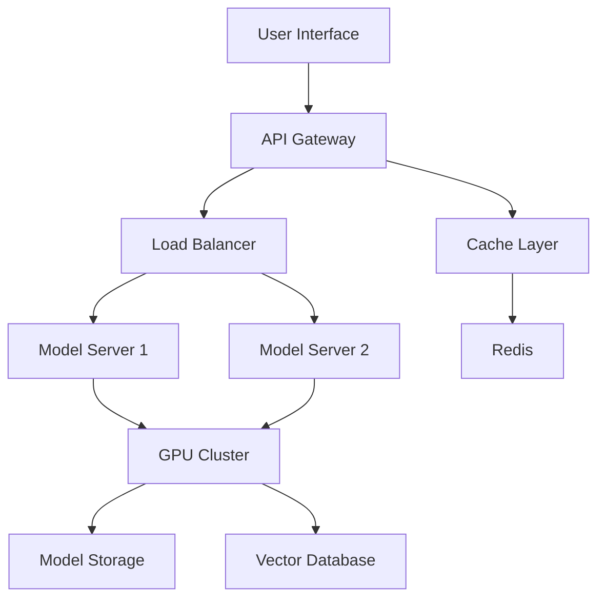

#### Cost Analysis
**Hardware Requirements:**
- **GPU**: 2x RTX 4090 (24GB VRAM each) - $3,000
- **CPU**: AMD Ryzen 9 7950X - $600
- **RAM**: 128GB DDR5 - $800
- **Storage**: 2TB NVMe SSD - $300
- **Total Hardware**: ~$4,700

**Monthly Operating Costs:**
- **Electricity**: $200-400/month
- **Internet**: $100/month
- **Maintenance**: $200/month
- **Total Monthly**: $500-700

**Performance:**
- **Throughput**: 10-50 requests/second
- **Latency**: 100-500ms
- **Concurrent Users**: 50-200

### 106. Cloud GPT Powered LLM System Design

**Answer:**

#### Cloud System Architecture
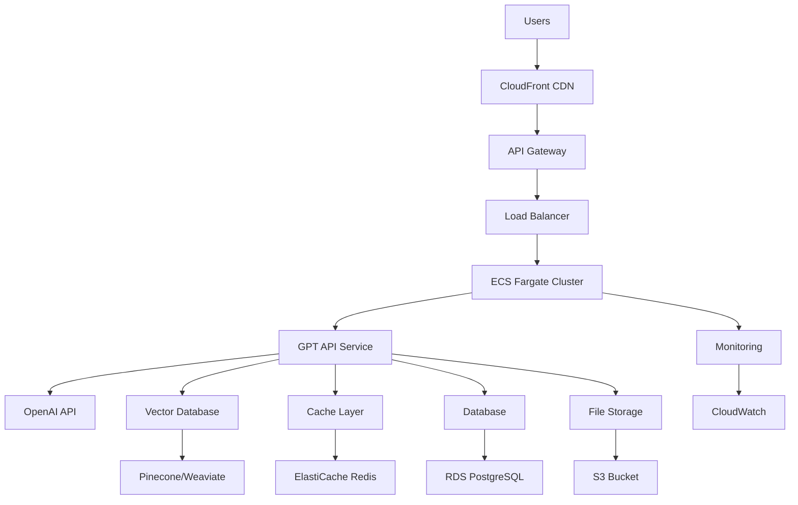

#### Alternative Cloud Architecture (Serverless)
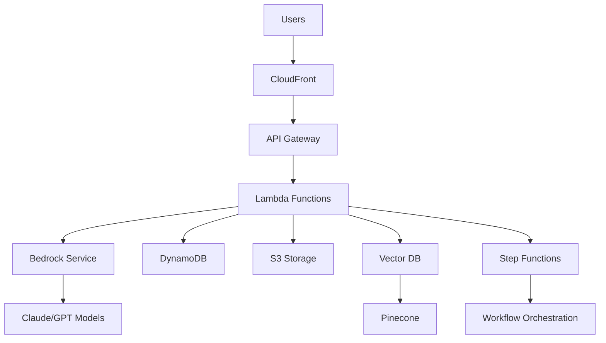

#### Cost Analysis - ECS Fargate Architecture
**Monthly Costs:**
- **ECS Fargate**: 
  - 2 vCPU, 4GB RAM: $0.04048/vCPU-hour × 2 × 24 × 30 = $58
  - 4 vCPU, 8GB RAM: $0.04048/vCPU-hour × 4 × 24 × 30 = $116
- **Application Load Balancer**: $16.20 + $0.008/LCU-hour = $22
- **RDS PostgreSQL (db.t3.medium)**: $150/month
- **ElastiCache Redis (cache.t3.micro)**: $50/month
- **S3 Storage (100GB)**: $2.30/month
- **CloudWatch Logs**: $5-20/month
- **OpenAI API**: $0.015/1k tokens × 1M tokens = $15/month
- **Pinecone Vector DB**: $70/month (Starter plan)

**Total Monthly Cost: $383-441**

#### Cost Analysis - Serverless Architecture
**Monthly Costs:**
- **Lambda Functions**: 
  - 1M requests: $0.20
  - 1M GB-seconds: $0.0000166667 × 1M = $16.67
- **API Gateway**: $3.50 per 1M requests = $3.50
- **DynamoDB**: $0.25/GB + $1.25/1M writes = $25
- **S3 Storage**: $2.30/month
- **Bedrock API**: $0.015/1k tokens × 1M tokens = $15/month
- **Pinecone Vector DB**: $70/month
- **Step Functions**: $0.000025/state transition × 10k = $0.25

**Total Monthly Cost: $133**

#### Performance Comparison
| Architecture | Latency | Throughput | Scalability | Cost |
|-------------|---------|------------|-------------|------|
| ECS Fargate | 200-500ms | 100-500 req/s | Manual scaling | $383-441/month |
| Serverless | 100-300ms | 1000+ req/s | Auto scaling | $133/month |
| Local GPU | 100-500ms | 10-50 req/s | Hardware limited | $500-700/month |

#### Use Case Recommendations
**ECS Fargate:**
- Production applications
- Predictable traffic patterns
- Need for persistent connections
- Custom model requirements

**Serverless:**
- Variable traffic patterns
- Cost optimization priority
- Rapid prototyping
- Event-driven applications

**Local GPU:**
- Data privacy requirements
- High-volume processing
- Custom model fine-tuning
- Offline capabilities

### 107. LLaMA Model, Claude Model - Local and Cloud

**Answer:**

#### LLaMA Models
**Local Deployment:**
```python
# LLaMA local setup
from transformers import LlamaForCausalLM, LlamaTokenizer

model = LlamaForCausalLM.from_pretrained("meta-llama/Llama-2-7b-hf")
tokenizer = LlamaTokenizer.from_pretrained("meta-llama/Llama-2-7b-hf")

def generate_response(prompt):
    inputs = tokenizer(prompt, return_tensors="pt")
    outputs = model.generate(**inputs, max_length=512)
    return tokenizer.decode(outputs[0], skip_special_tokens=True)
```

**Cloud Deployment (HuggingFace):**
- **Cost**: $0.0006-0.002 per 1k tokens
- **Infrastructure**: Managed inference endpoints
- **Scalability**: Auto-scaling based on demand

#### Claude Models
**Local Deployment:**
- **Limitation**: Claude models are not open-source
- **Alternative**: Use open-source alternatives like LLaMA

**Cloud Deployment (Anthropic API):**
```python
import anthropic

client = anthropic.Anthropic(api_key="your-api-key")

def claude_generate(prompt):
    response = client.messages.create(
        model="claude-3-sonnet-20240229",
        max_tokens=1000,
        messages=[{"role": "user", "content": prompt}]
    )
    return response.content[0].text
```

**Cost Comparison:**
| Model | Local Cost | Cloud Cost | Context Length |
|-------|------------|------------|----------------|
| LLaMA-2-7B | $500/month | $0.002/1k tokens | 4k tokens |
| LLaMA-2-70B | $2000/month | $0.008/1k tokens | 4k tokens |
| Claude-3-Sonnet | N/A | $0.015/1k tokens | 200k tokens |

### 108. Security Concerns - Local and Cloud

**Answer:**

#### Local Deployment Security
**Architecture:**
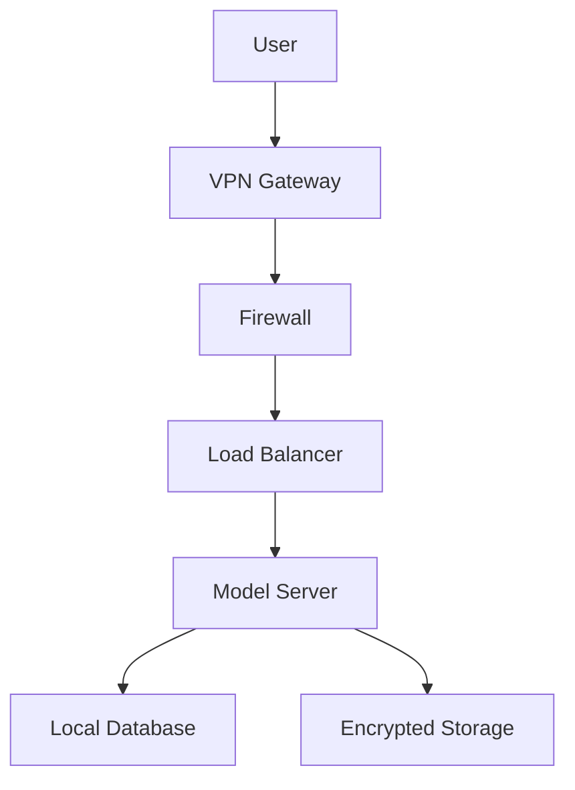

**Security Features:**
- **Network Isolation**: Air-gapped environment
- **Data Encryption**: AES-256 at rest and in transit
- **Access Control**: Role-based authentication
- **Audit Logging**: Complete activity tracking

**Limitations:**
- **Hardware Costs**: High upfront investment
- **Maintenance**: Requires IT expertise
- **Scalability**: Limited by hardware capacity

#### Cloud Deployment Security
**Architecture:**
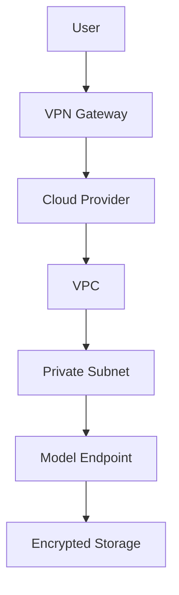

**Security Features:**
- **VPC**: Isolated network environment
- **IAM**: Fine-grained access control
- **Encryption**: End-to-end encryption
- **Compliance**: SOC 2, GDPR, HIPAA

**Limitations:**
- **Data Residency**: May not meet all requirements
- **Vendor Lock-in**: Dependent on cloud provider
- **Cost**: Ongoing operational expenses

#### Model-Specific Security Considerations

**GPT Models:**
- **Data Processing**: Data may be processed by OpenAI
- **Retention**: Data retained for 30 days
- **Limitation**: Cannot guarantee complete data isolation

**Claude Models:**
- **Data Processing**: Data processed by Anthropic
- **Retention**: Data retained for limited time
- **Limitation**: Similar to GPT, no complete isolation

**LLaMA Models:**
- **Local Control**: Complete data control
- **No External Calls**: Data never leaves premises
- **Advantage**: Maximum security and privacy

### 109. HuggingFace Knowledge

**Answer:**

#### a. Inference Endpoints - Secure LLM Solution
**Architecture:**
```python
# HuggingFace Inference Endpoints
from huggingface_hub import InferenceClient

client = InferenceClient("https://your-endpoint.hf.space")

def secure_llm_call(prompt):
    response = client.text_generation(
        prompt,
        max_new_tokens=512,
        temperature=0.7
    )
    return response
```

**Security Features:**
- **Private Endpoints**: Not accessible publicly
- **VPC Integration**: Deploy in your VPC
- **Encryption**: Data encrypted in transit and at rest
- **Access Control**: IAM-based authentication

**Cost:**
- **Small Instance**: $0.60/hour (~$430/month)
- **Medium Instance**: $1.20/hour (~$860/month)
- **Large Instance**: $2.40/hour (~$1,720/month)

#### b. Using HuggingFace API
```python
# HuggingFace API usage
import requests

def hf_api_call(prompt, model="microsoft/DialoGPT-medium"):
    API_URL = f"https://api-inference.huggingface.co/models/{model}"
    headers = {"Authorization": f"Bearer {HF_TOKEN}"}
    
    response = requests.post(API_URL, headers=headers, json={
        "inputs": prompt,
        "parameters": {"max_length": 100}
    })
    return response.json()
```

#### c. HuggingFace Local Models
```python
# Local model deployment
from transformers import pipeline

# Load model locally
generator = pipeline("text-generation", model="gpt2")

def local_generation(prompt):
    result = generator(prompt, max_length=100, num_return_sequences=1)
    return result[0]["generated_text"]
```

**Advantages:**
- **Complete Control**: Data never leaves your environment
- **Cost Effective**: No per-token charges
- **Customization**: Full model modification capabilities
- **Offline**: Works without internet connection

### 110. AWS Cloud Infrastructure for GPT Powered LLM System

**Answer:**

#### Design 1: Serverless with Bedrock
**Architecture:**
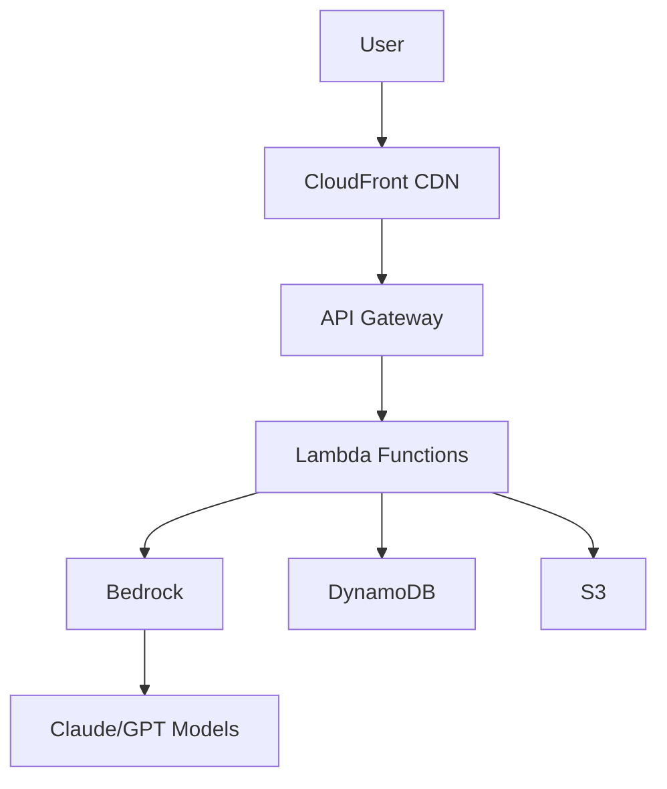

**Components:**
- **Frontend**: React/Vue.js on S3 + CloudFront
- **Backend**: Lambda functions for API logic
- **LLM**: AWS Bedrock for model access
- **Database**: DynamoDB for user data
- **Storage**: S3 for file storage

**Cost (Monthly):**
- **Bedrock**: $0.015/1k tokens (~$500/month)
- **Lambda**: $0.20 per 1M requests (~$100/month)
- **DynamoDB**: $0.25 per GB (~$50/month)
- **S3**: $0.023 per GB (~$30/month)
- **Total**: ~$680/month

**Use Cases**: Startups, MVPs, cost-sensitive applications

#### Design 2: Containerized with ECS
**Architecture:**
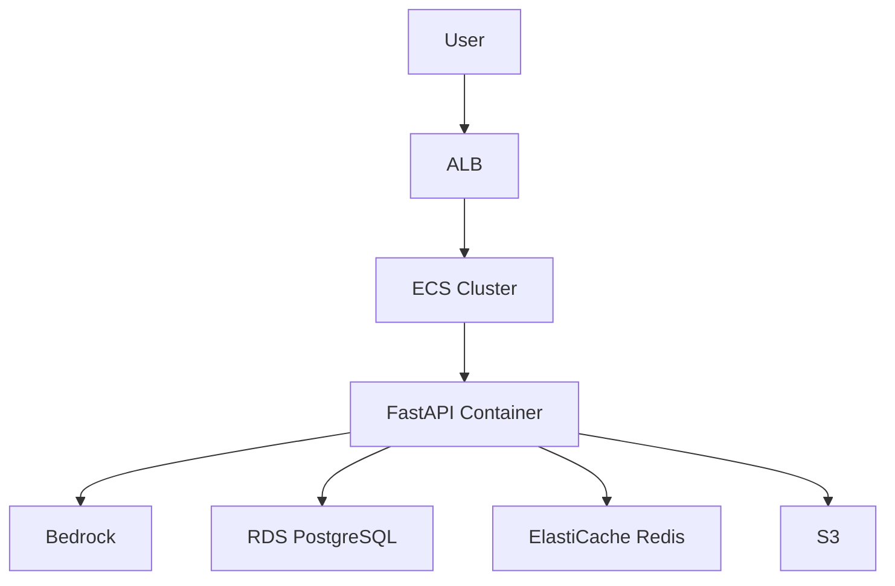

**Components:**
- **Frontend**: Containerized React app
- **Backend**: FastAPI on ECS Fargate
- **LLM**: AWS Bedrock
- **Database**: RDS PostgreSQL
- **Cache**: ElastiCache Redis

**Cost (Monthly):**
- **ECS Fargate**: $0.04048 per vCPU hour (~$300/month)
- **RDS**: db.t3.medium (~$150/month)
- **ElastiCache**: cache.t3.micro (~$50/month)
- **Bedrock**: $0.015/1k tokens (~$500/month)
- **Total**: ~$1,000/month

**Use Cases**: Production applications, medium scale

#### Design 3: Kubernetes with SageMaker
**Architecture:**
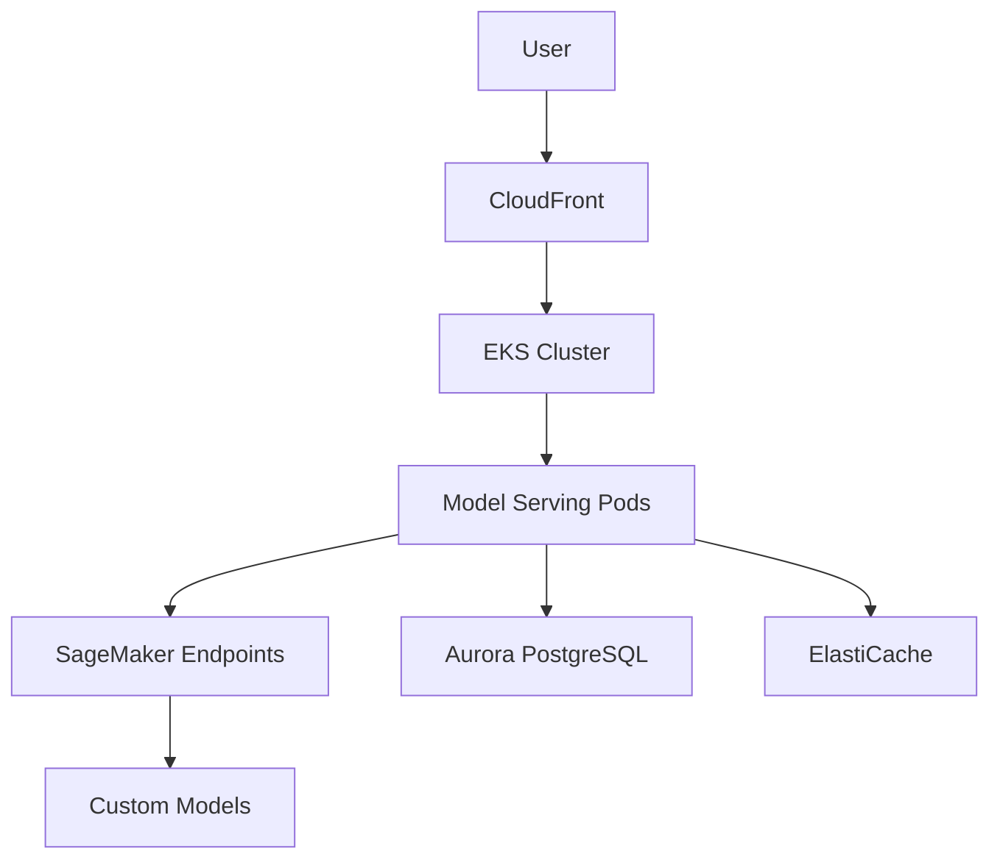

**Components:**
- **Frontend**: Kubernetes-managed React
- **Backend**: Python services on EKS
- **LLM**: SageMaker endpoints with custom models
- **Database**: Aurora PostgreSQL
- **Cache**: ElastiCache Redis

**Cost (Monthly):**
- **EKS**: $0.10 per hour (~$75/month)
- **EC2 Instances**: c5.2xlarge (~$400/month)
- **SageMaker**: $0.05 per hour (~$360/month)
- **Aurora**: db.r5.large (~$200/month)
- **Total**: ~$1,035/month

**Use Cases**: Enterprise applications, high scale, custom models

### 111. AWS Bedrock Details

**Answer:**

#### a. Where Bedrock Fits in LLM System
**Position in Architecture:**
```
User Request → API Gateway → Application Logic → Bedrock → LLM Models → Response
```

**Key Features:**
- **Model Access**: Claude, Llama, Titan models
- **Serverless**: No infrastructure management
- **Enterprise Security**: VPC, IAM, encryption
- **Fine-tuning**: Custom model training

#### b. Cost and Infrastructure Scalability
**Pricing Model:**
- **Claude 3 Sonnet**: $0.003/1k input tokens, $0.015/1k output tokens
- **Llama 2 70B**: $0.00265/1k input tokens, $0.0035/1k output tokens
- **Titan Text**: $0.0008/1k input tokens, $0.0016/1k output tokens

**Scalability:**
- **Automatic Scaling**: Handles traffic spikes
- **No Infrastructure**: Managed service
- **Global Availability**: Multiple regions
- **High Availability**: 99.9% uptime SLA

#### c. Advantages and Popularity
**Advantages:**
- **Enterprise Ready**: Security, compliance, governance
- **Cost Effective**: Pay-per-use pricing
- **Easy Integration**: Simple API calls
- **Model Variety**: Access to multiple providers

**Why Popular:**
- **No Vendor Lock-in**: Multiple model providers
- **Compliance**: Meets enterprise requirements
- **Scalability**: Handles any scale
- **Cost**: Competitive pricing

### 112. AWS Orchestration of LLM System

**Answer:**

#### a. Step Functions
**Use Case**: Complex LLM workflows
```python
# Step Functions state machine
{
  "Comment": "LLM Processing Workflow",
  "StartAt": "PreprocessInput",
  "States": {
    "PreprocessInput": {
      "Type": "Task",
      "Resource": "arn:aws:lambda:region:account:function:preprocess",
      "Next": "CallBedrock"
    },
    "CallBedrock": {
      "Type": "Task",
      "Resource": "arn:aws:states:::bedrock:invokeModel",
      "Next": "PostprocessOutput"
    },
    "PostprocessOutput": {
      "Type": "Task",
      "Resource": "arn:aws:lambda:region:account:function:postprocess",
      "End": true
    }
  }
}
```

#### b. SageMaker
**Use Case**: Custom model training and deployment
```python
# SageMaker endpoint deployment
from sagemaker.huggingface import HuggingFaceModel

huggingface_model = HuggingFaceModel(
    model_data="s3://bucket/model.tar.gz",
    role=role,
    transformers_version="4.26.0",
    pytorch_version="1.13.1",
    py_version="py39"
)

predictor = huggingface_model.deploy(
    initial_instance_count=1,
    instance_type="ml.m5.large"
)
```

#### c. Bedrock
**Use Case**: Managed LLM inference
```python
# Bedrock client usage
import boto3

bedrock = boto3.client('bedrock-runtime')

def call_bedrock(prompt, model_id="anthropic.claude-3-sonnet-20240229-v1:0"):
    response = bedrock.invoke_model(
        modelId=model_id,
        body=json.dumps({
            "prompt": prompt,
            "max_tokens_to_sample": 1000
        })
    )
    return json.loads(response['body'].read())
```

### 113. OLLAMA - Simple Architecture and Usage

**Answer:**

#### Architecture
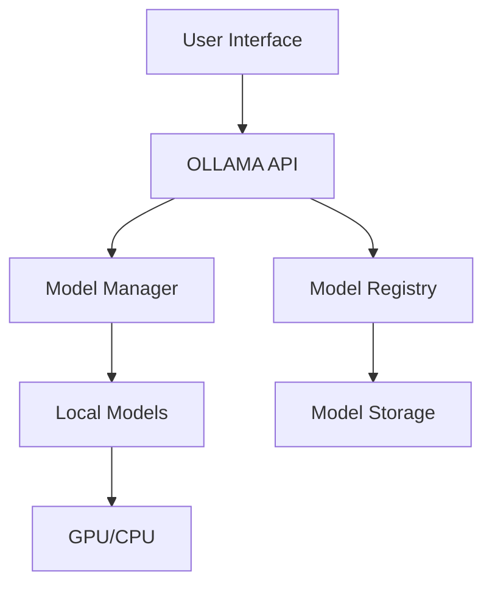

**Key Components:**
- **Model Manager**: Handles model loading/unloading
- **API Server**: RESTful API for model access
- **Model Registry**: Manages available models
- **Inference Engine**: Runs model inference

#### Python LLM Call - Text Generation
```python
import requests
import json

class OllamaClient:
    def __init__(self, base_url="http://localhost:11434"):
        self.base_url = base_url
    
    def generate_text(self, prompt, model="llama2"):
        url = f"{self.base_url}/api/generate"
        data = {
            "model": model,
            "prompt": prompt,
            "stream": False
        }
        
        response = requests.post(url, json=data)
        return response.json()["response"]
    
    def chat(self, messages, model="llama2"):
        url = f"{self.base_url}/api/chat"
        data = {
            "model": model,
            "messages": messages
        }
        
        response = requests.post(url, json=data)
        return response.json()["message"]["content"]

# Usage
client = OllamaClient()
response = client.generate_text("Explain quantum computing")
print(response)
```

#### Python LLM Call - Multimodal
```python
import base64
import requests

def generate_with_image(prompt, image_path, model="llava"):
    # Encode image
    with open(image_path, "rb") as image_file:
        image_data = base64.b64encode(image_file.read()).decode()
    
    # Prepare request
    data = {
        "model": model,
        "prompt": prompt,
        "images": [image_data],
        "stream": False
    }
    
    response = requests.post("http://localhost:11434/api/generate", json=data)
    return response.json()["response"]

# Usage
response = generate_with_image(
    "Describe this image", 
    "path/to/image.jpg"
)
print(response)
```

#### Different Ways to Use OLLAMA
1. **Command Line**: `ollama run llama2`
2. **Python API**: Using requests library
3. **Web Interface**: Ollama WebUI
4. **Docker**: Containerized deployment
5. **REST API**: Direct HTTP calls

### 114. Claude - Simple Architecture and Usage

**Answer:**

#### Architecture
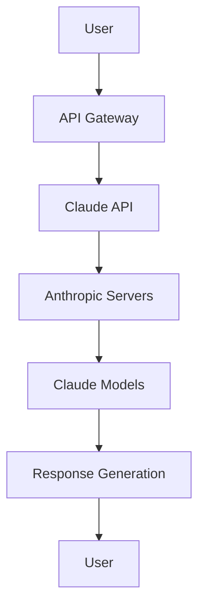

**Key Components:**
- **API Gateway**: Request routing and authentication
- **Claude API**: Anthropic's API service
- **Model Servers**: Hosted Claude models
- **Response Engine**: Generates and formats responses

#### Python LLM Call - Text Generation
```python
import anthropic
import os

class ClaudeClient:
    def __init__(self, api_key=None):
        self.client = anthropic.Anthropic(
            api_key=api_key or os.getenv("ANTHROPIC_API_KEY")
        )
    
    def generate_text(self, prompt, model="claude-3-sonnet-20240229"):
        response = self.client.messages.create(
            model=model,
            max_tokens=1000,
            messages=[{"role": "user", "content": prompt}]
        )
        return response.content[0].text
    
    def chat(self, messages, model="claude-3-sonnet-20240229"):
        response = self.client.messages.create(
            model=model,
            max_tokens=1000,
            messages=messages
        )
        return response.content[0].text

# Usage
client = ClaudeClient()
response = client.generate_text("Write a Python function to sort a list")
print(response)
```

#### Python LLM Call - Multimodal
```python
import base64
import anthropic

def claude_vision(prompt, image_path):
    client = anthropic.Anthropic()
    
    # Encode image
    with open(image_path, "rb") as image_file:
        image_data = base64.b64encode(image_file.read()).decode()
    
    response = client.messages.create(
        model="claude-3-sonnet-20240229",
        max_tokens=1000,
        messages=[
            {
                "role": "user",
                "content": [
                    {"type": "text", "text": prompt},
                    {
                        "type": "image",
                        "source": {
                            "type": "base64",
                            "media_type": "image/jpeg",
                            "data": image_data
                        }
                    }
                ]
            }
        ]
    )
    return response.content[0].text

# Usage
response = claude_vision("What's in this image?", "image.jpg")
print(response)
```

#### Different Ways to Use Claude
1. **API Integration**: Direct API calls
2. **SDK Usage**: Python/JavaScript SDKs
3. **Web Interface**: Claude.ai website
4. **Third-party Tools**: Various integrations
5. **Custom Applications**: Build your own interface

### 115. GPT - Simple Architecture and Usage

**Answer:**

#### Architecture
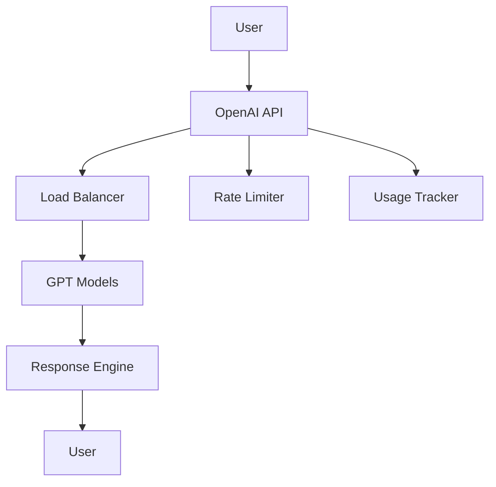

**Key Components:**
- **API Gateway**: OpenAI's API service
- **Load Balancer**: Distributes requests
- **GPT Models**: Various model versions
- **Response Engine**: Generates and formats responses

#### Python LLM Call - Text Generation
```python
import openai
import os

class GPTClient:
    def __init__(self, api_key=None):
        self.client = openai.OpenAI(
            api_key=api_key or os.getenv("OPENAI_API_KEY")
        )
    
    def generate_text(self, prompt, model="gpt-4o-mini"):
        response = self.client.chat.completions.create(
            model=model,
            messages=[{"role": "user", "content": prompt}],
            max_tokens=1000,
            temperature=0.7
        )
        return response.choices[0].message.content
    
    def chat(self, messages, model="gpt-4o-mini"):
        response = self.client.chat.completions.create(
            model=model,
            messages=messages,
            max_tokens=1000,
            temperature=0.7
        )
        return response.choices[0].message.content

# Usage
client = GPTClient()
response = client.generate_text("Explain machine learning")
print(response)
```

#### Python LLM Call - Multimodal
```python
import openai
from openai import OpenAI

def gpt_vision(prompt, image_path):
    client = OpenAI()
    
    with open(image_path, "rb") as image_file:
        response = client.chat.completions.create(
            model="gpt-4o",
            messages=[
                {
                    "role": "user",
                    "content": [
                        {"type": "text", "text": prompt},
                        {
                            "type": "image_url",
                            "image_url": {
                                "url": f"data:image/jpeg;base64,{base64.b64encode(image_file.read()).decode()}"
                            }
                        }
                    ]
                }
            ],
            max_tokens=1000
        )
    return response.choices[0].message.content

# Usage
response = gpt_vision("Describe this image", "image.jpg")
print(response)
```

#### Different Ways to Use GPT
1. **API Integration**: Direct API calls
2. **SDK Usage**: Python/JavaScript SDKs
3. **Web Interface**: ChatGPT website
4. **Third-party Tools**: Various integrations
5. **Custom Applications**: Build your own interface

### 116. Lovable.AI - Basics and Cost

**Answer:**

#### How to Use Lovable.AI
**Platform Overview:**
- **Purpose**: AI-powered web application development
- **Target**: Rapid prototyping and MVP development
- **Technology**: React, TypeScript, AI-generated code

**Usage Process:**
1. **Sign Up**: Create account on lovable.dev
2. **Describe Project**: Tell AI what you want to build
3. **AI Generation**: Platform generates code automatically
4. **Customization**: Modify and refine generated code
5. **Deployment**: Deploy to cloud platforms

**Example Workflow:**
```python
# Lovable.AI API usage (pseudo-code)
import requests

def create_lovable_app(description):
    response = requests.post("https://api.lovable.dev/apps", json={
        "description": description,
        "framework": "react",
        "features": ["authentication", "database", "api"]
    })
    return response.json()

# Usage
app = create_lovable_app("Build a task management app with user authentication")
```

#### Cost Implications
**Pricing Model:**
- **Free Tier**: Limited projects and features
- **Pro Plan**: $29/month
  - Unlimited projects
  - Advanced AI features
  - Priority support
- **Enterprise**: Custom pricing
  - On-premise deployment
  - Custom integrations
  - Dedicated support

**Additional Costs:**
- **Hosting**: $5-50/month (depending on platform)
- **Database**: $10-100/month (depending on usage)
- **Third-party APIs**: Variable based on usage
- **Custom Development**: $50-200/hour

**Total Monthly Cost:**
- **Small Project**: $50-100/month
- **Medium Project**: $100-300/month
- **Large Project**: $300-1000/month

### 117. Anthropic - Basics and Cost

**Answer:**

#### How to Use Anthropic
**Platform Overview:**
- **Purpose**: AI safety and research company
- **Main Product**: Claude AI assistant
- **Focus**: Helpful, harmless, and honest AI

**Usage Methods:**
1. **Claude.ai**: Web interface
2. **API Integration**: Direct API calls
3. **SDK Usage**: Python/JavaScript SDKs
4. **Third-party Tools**: Various integrations

**API Usage:**
```python
import anthropic

client = anthropic.Anthropic(api_key="your-api-key")

def claude_chat(message):
    response = client.messages.create(
        model="claude-3-sonnet-20240229",
        max_tokens=1000,
        messages=[{"role": "user", "content": message}]
    )
    return response.content[0].text

# Usage
response = claude_chat("Explain quantum computing")
print(response)
```

#### Cost Implications
**Pricing Structure:**
- **Claude 3 Haiku**: $0.25/1M input tokens, $1.25/1M output tokens
- **Claude 3 Sonnet**: $3/1M input tokens, $15/1M output tokens
- **Claude 3 Opus**: $15/1M input tokens, $75/1M output tokens

**Cost Examples:**
- **1M input tokens**: ~750,000 words
- **1M output tokens**: ~750,000 words
- **Typical conversation**: 1000-5000 tokens
- **Cost per conversation**: $0.01-0.10

**Monthly Cost Estimates:**
- **Light Usage**: $10-50/month
- **Medium Usage**: $50-200/month
- **Heavy Usage**: $200-1000/month
- **Enterprise**: Custom pricing

### 118. Perplexity - Basics and Cost

**Answer:**

#### How to Use Perplexity
**Platform Overview:**
- **Purpose**: AI-powered search and research
- **Key Feature**: Real-time information with citations
- **Target**: Research, fact-checking, current events

**Usage Methods:**
1. **Web Interface**: perplexity.ai
2. **API Integration**: Direct API calls
3. **Mobile Apps**: iOS and Android
4. **Browser Extensions**: Chrome, Firefox

**API Usage:**
```python
import requests

def perplexity_search(query):
    url = "https://api.perplexity.ai/chat/completions"
    headers = {
        "Authorization": f"Bearer {PERPLEXITY_API_KEY}",
        "Content-Type": "application/json"
    }
    
    data = {
        "model": "llama-3.1-sonar-small-128k-online",
        "messages": [{"role": "user", "content": query}],
        "max_tokens": 1000
    }
    
    response = requests.post(url, headers=headers, json=data)
    return response.json()

# Usage
result = perplexity_search("Latest developments in AI")
print(result)
```

#### Cost Implications
**Pricing Structure:**
- **Free Tier**: 5 searches per day
- **Pro Plan**: $20/month
  - Unlimited searches
  - Advanced features
  - Priority access
- **Enterprise**: Custom pricing
  - Team collaboration
  - Advanced analytics
  - Custom integrations

**API Pricing:**
- **Pay-per-use**: $0.20 per 1k tokens
- **Monthly limits**: Various tiers available
- **Bulk discounts**: Available for high usage

**Monthly Cost Estimates:**
- **Free Tier**: $0 (limited usage)
- **Pro Plan**: $20/month
- **API Usage**: $10-100/month (depending on usage)
- **Enterprise**: $100-1000/month

---

## Conclusion

This comprehensive interview preparation guide covers all the essential topics for an AI Engineer GPT Specialist role. The questions range from fundamental concepts to advanced implementation details, covering:

- **LLM Fundamentals**: Model comparison, architecture, tokenization
- **RAG Systems**: Retrieval, generation, evaluation
- **AI Agents**: Architecture, decision-making, tool integration
- **MCP Protocol**: Standardized communication, tool discovery
- **Fine-tuning**: Model adaptation, training, evaluation
- **System Design**: Scalability, performance, security
- **Cloud Integration**: AWS Bedrock, cost optimization
- **Production Deployment**: Monitoring, testing, troubleshooting

Each answer is concise yet comprehensive, providing the theoretical understanding and practical insights needed to excel in AI engineering interviews. The questions are designed to test both technical knowledge and practical problem-solving abilities, making this guide an essential resource for interview preparation.

Remember to practice explaining these concepts clearly and concisely, as effective communication is just as important as technical knowledge in AI engineering roles.
