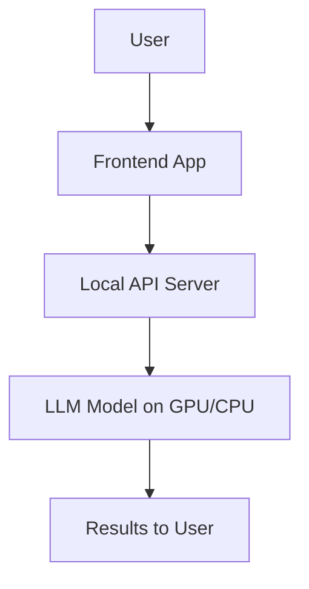
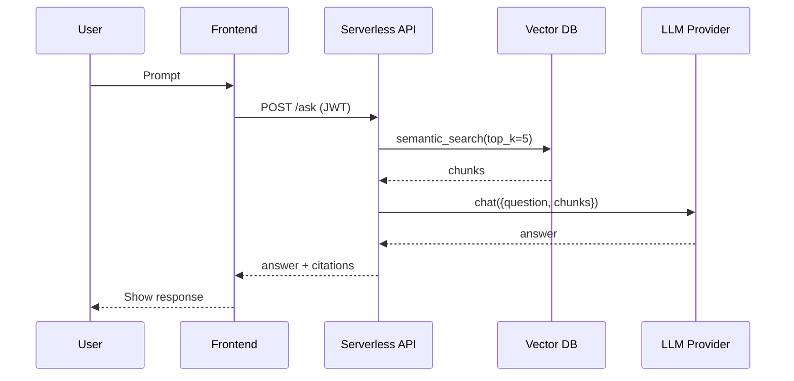
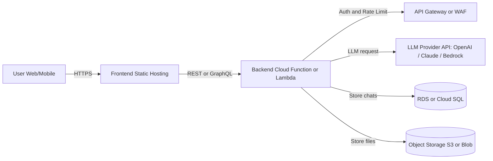
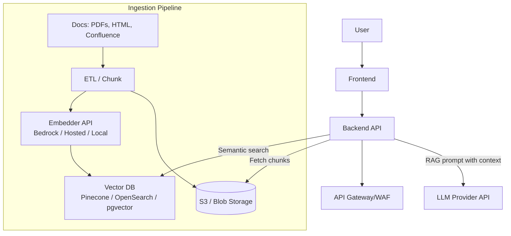
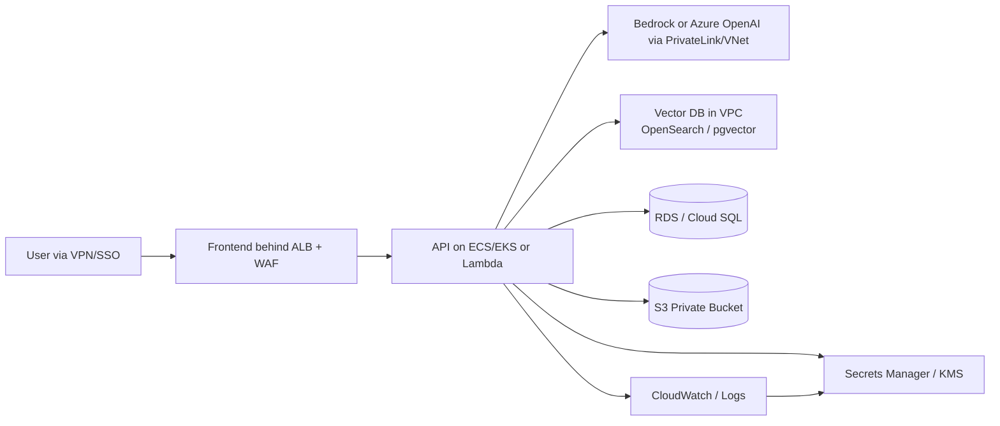
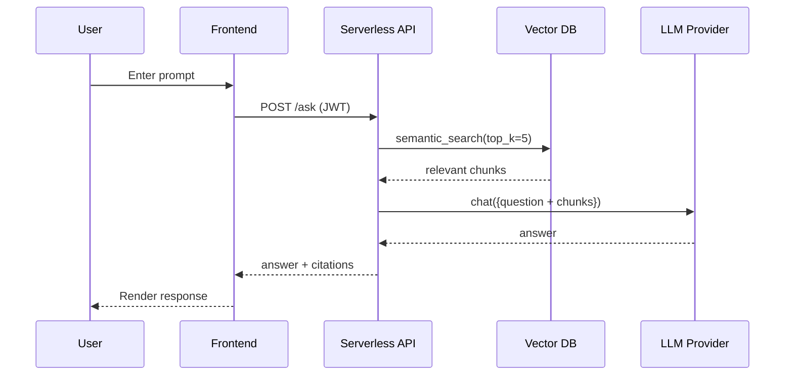
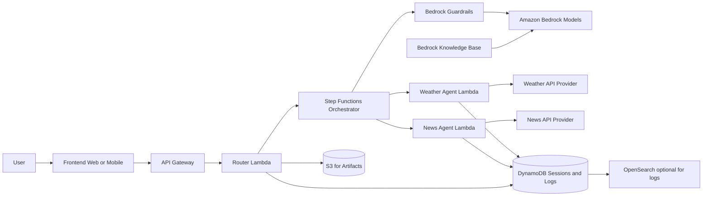
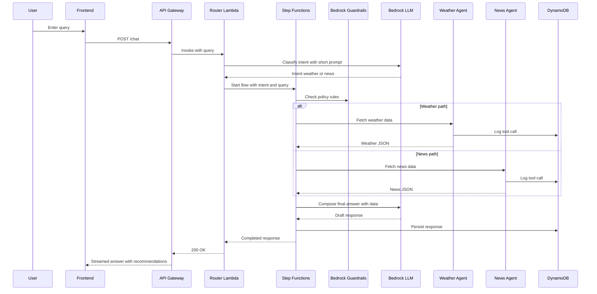

Got it ✅
Here’s a **Markdown (.md) interview prep document** with **layman-friendly, theoretical explanations**, **simple pseudo-code**, and **diagrams (mermaid)** where useful.
This will help you **explain concepts clearly in interviews without going too technical** while still showing strong understanding.

---

# AI Engineer – GPT Specialist Interview Prep

---

## **101. GPT Parameters – Default, Range, Meaning**

When we interact with GPT models, we can tune how the model "thinks" by adjusting key parameters:

### a. Temperature

* **Meaning**: Controls creativity. Higher = more random, lower = more focused.
* **Range**: `0 → 2`
* **Default**: Around `0.7`
* **Analogy**: Like asking 10 people to guess your mood → higher temperature = wild guesses, lower temperature = precise guesses.

```pseudo
if temperature = 0:
    always choose the most likely word
else:
    add randomness proportional to temperature
```

---

### b. Top-k

* **Meaning**: Only consider the top **k most likely words** before picking one.
* **Range**: `1 → 1000`
* **Default**: `50`
* **Analogy**: Instead of choosing from the whole dictionary, restrict to the top `k` best guesses.

---

### c. Top-p (Nucleus Sampling)

* **Meaning**: Instead of fixed number `k`, choose words until their **probability mass ≥ p**.
* **Range**: `0.1 → 1.0`
* **Default**: `1.0`
* **Analogy**: If `p=0.9`, the model only considers words that together make up 90% of likelihood.

---

## **102. Latest GPT Models and Purpose**

| Model       | Purpose                                      |
| ----------- | -------------------------------------------- |
| GPT-4o      | Multimodal (text, image, audio input/output) |
| GPT-4o-mini | Lightweight, cheaper, faster text + vision   |
| GPT-4 Turbo | Optimized for cost + long context            |
| GPT-3.5     | Cheaper text generation (legacy)             |

👉 **Summary**:

* Use **GPT-4o** for cutting-edge multimodal tasks.
* Use **GPT-4o-mini** when speed/cost is priority.
* Use **GPT-4 Turbo** for **long documents + scalability**.
* Use **GPT-3.5** if budget is very tight.

---

## **103. Context Length & Token Limits**

* **Context length** = how much conversation (input + output) the model can remember at once.
* **Token** = \~4 characters in English text.

| Model       | Max Context | Input Tokens | Output Tokens |
| ----------- | ----------- | ------------ | ------------- |
| GPT-4o      | 128k        | up to 128k   | \~4k–8k       |
| GPT-4o-mini | 128k        | up to 128k   | \~4k–8k       |
| GPT-3.5     | 16k–32k     | varies       | \~4k          |

👉 **Rule**: Larger context → higher cost, slower inference.

---

## **104. 3 Ways to Deploy GPT-powered LLMs**

1. **Small Context – API Call**

   * Use OpenAI/HuggingFace API
   * No infra needed, fastest setup
   * Cost: Pay per token

2. **Large Context – Cloud Deployment**

   * Host via AWS Bedrock or Azure OpenAI
   * Handles **long docs (100k+ tokens)**
   * Cost: higher, but scalable

3. **In-house (On-Premise)**

   * Run open-source models (LLaMA, Mistral) locally
   * Cost: GPU hardware upfront, no per-token API bills
   * Use when **data privacy** is critical

---

## **105 & 106. Local GPT System Design (Diagram + Cost)**



* **Infra**:

  * GPU server (e.g., NVIDIA A100)
  * Local database (Postgres)
  * Backend API (Python/Flask/FastAPI)
* **Cost**:

  * GPU server: \$10k–\$15k upfront OR \~\$3/hr cloud rental
  * Free after hardware setup (no per-token cost)

---

## **107. LLaMA vs Claude – Local & Cloud**

```mermaid
flowchart LR
    User -->|Prompt| APIorLocal
    APIorLocal --> ClaudeCloud[Claude (Cloud)]
    APIorLocal --> LLaMALocal[LLaMA (Local GPU)]
```

* **Claude (Anthropic)**

  * **Cloud only** (via API)
  * Cost: \~\$3–15 per million tokens
* **LLaMA (Meta)**

  * **Local possible** if GPU available
  * Cost: Hardware upfront OR HuggingFace hosting

---

## **108. Security Concerns – Local vs Cloud**

* **Local Deployment**

  * All data stays inside company network
  * Needs GPU infra
  * Limitation: expensive, harder scaling

* **Cloud Deployment (GPT, Claude, LLaMA)**

  * Easy scaling
  * Security risk: data leaves network unless **private cloud/VPC**
  * HuggingFace **private inference endpoints** help mitigate

👉 **Limitation**:

* GPT & Claude = cloud only
* LLaMA = can run fully on-prem

---

## **109. HuggingFace Knowledge**

### a. Inference Endpoints

* Run models securely in HuggingFace cloud
* Company data → **does not leave VPC**
* ✅ Solution for secured LLMs without GPUs

### b. HuggingFace API

```pseudo
POST https://api-inference.huggingface.co/models/llama-2
Authorization: Bearer YOUR_API_KEY
{ "inputs": "Hello world" }
```

### c. Local Models

* Download weights from HuggingFace
* Run with libraries like `transformers` or `ollama`

---

## **110. AWS Cloud Infra – 3 Designs**

### Design 1 – Simple (EC2 + RDS + OpenAI API)

* **Infra**: Python backend, Postgres DB, GPT via API
* **Cost**: \$200–500/month
* **Use case**: Startups, small apps

---

### Design 2 – Bedrock-based

* **Infra**: AWS Bedrock for GPT access + Lambda + RDS
* **Cost**: Pay per token, scalable
* **Use case**: Enterprise scale, compliance-friendly

---

### Design 3 – SageMaker LLM Hosting

* **Infra**: Deploy LLaMA/Mistral models in SageMaker
* **Cost**: GPU runtime (\$2–\$10/hr)
* **Use case**: When company wants **control + privacy**

---

## **111. AWS Bedrock Details**

* **Where**: Middle layer between app and LLM
* **Cost**: Pay-as-you-go (per token)
* **Advantage**:

  * No infra mgmt
  * Enterprise security
  * Popular because **multi-model (Anthropic, Cohere, Meta)** in one API

---

## **112. AWS Orchestration**

* **Step Functions**: Automate LLM workflows (multi-step pipelines)
* **SageMaker**: Train/deploy custom models
* **Bedrock**: Ready-made inference API

👉 **Together**:

* Bedrock = inference
* SageMaker = custom training
* Step Functions = orchestration

---

## **113. Simple Ollama**

* **Architecture**: Local LLM runtime (Mac/Linux)

```pseudo
ollama run llama2 "Write a poem about AI"
```

* **Python Call**

```python
import ollama
response = ollama.chat(model="llama2", messages=[{"role":"user","content":"Hello"}])
print(response)
```

* **Uses**: text gen, embeddings, multimodal (if supported)

---

## **114. Simple Claude**

* **Architecture**: API-only (Anthropic cloud)
* **Python Call**

```python
from anthropic import Anthropic
client = Anthropic(api_key="YOUR_KEY")
resp = client.messages.create(model="claude-3-opus", messages=[{"role":"user","content":"Hi"}])
print(resp.content)
```

* **Uses**: Long docs, chatbots, reasoning tasks

---

## **115. Simple GPT**

* **Architecture**: API-only (OpenAI cloud)
* **Python Call**

```python
from openai import OpenAI
client = OpenAI(api_key="YOUR_KEY")
resp = client.chat.completions.create(model="gpt-4o", messages=[{"role":"user","content":"Hi"}])
print(resp.choices[0].message)
```

* **Uses**: Text, multimodal (image/audio input/output)

---

## **116. Basics of Lovable.AI**

* **What**: AI app builder (no-code + low-code)
* **How to Use**: Prompt-driven app creation
* **Cost**: Subscription based (\~\$20–50/month)

---

## **117. Basics of Anthropic**

* **What**: Company behind Claude models
* **How to Use**: API calls (like OpenAI)
* **Cost**: \~\$3–15 per million tokens depending on model

---

## **118. Basics of Perplexity**

* **What**: AI search assistant (ChatGPT + Search)
* **How to Use**: Free + Pro subscription
* **Cost**: Free tier + Pro plan (\$20/month)

---

✅ This prep keeps it **simple, interview-ready, and non-technical enough** for layman explanation but strong enough to show depth.

---

Do you want me to **condense this into a “1-page cheat sheet” PDF** with all diagrams + pseudo code summarized (for quick glance before interview)?


# 106) GPT-Powered LLM in the **Cloud** — Simple System Designs (with Diagrams & Costs)

Below are **three progressively richer cloud designs** you can pitch in an interview. They’re simple, secure-by-default, and easy to explain. Each includes a **Mermaid diagram**, a quick **pseudocode** sketch, and **ballpark costs** with clear assumptions.

---

## A) “Lean & Fast” — **API-only App** (no vector DB)

**When to use:** Chatbot, drafting, Q\&A over short prompts; no private-doc search.
**Pros:** Easiest, fastest to ship. **Cons:** No long-term memory/RAG.

```mermaid
flowchart LR
  U[User Web/Mobile]
  FE[Frontend Static Hosting]
  BE[Backend Cloud Function or Lambda]
  AGW[API Gateway or WAF]
  LLM[LLM Provider API<br/>OpenAI / Claude / Bedrock]
  DB[(RDS or Cloud SQL)]
  OBJ[(Object Storage S3/Blob)]

  U -->|HTTPS| FE
  FE -->|REST/GraphQL| BE
  BE -->|AuthN + Rate Limit| AGW
  BE -->|LLM request (tokens)| LLM
  BE -->|Store chats| DB
  BE -->|Store files| OBJ

```

**Pseudocode (Cloud Function):**

```pseudo
handler(request):
  user = auth.verify(request.headers)
  text = request.body.prompt
  response = llm.chat(model="gpt-4o", messages=[{"role":"user","content":text}])
  db.save(user.id, text, response)
  return response
```

**Ballpark Cost / Month (indicative):**

* **LLM usage:** Depends on tokens. See formula below.
* **Backend (serverless):** \$10–\$50 (API Gateway + Functions at low traffic)
* **DB (RDS/Cloud SQL small):** \$30–\$100
* **Object Storage:** \$1–\$10 (light usage)
* **Total (light)**: **\$50–\$250 + LLM tokens**

**Token Cost Formula (generic):**

```
Monthly_LLM_Cost ≈ (Input_Tokens * $/M_in) + (Output_Tokens * $/M_out)
Example Workload:
  100k requests/month
  avg 800 input + 200 output tokens
  => Input = 80M tokens, Output = 20M tokens

If unit prices were (illustrative):
  $/M_in = $3, $/M_out = $15
Then:
  Cost ≈ (80 * 3) + (20 * 15) = $240 + $300 = $540
```

> Use **your provider’s current price sheet** in production; above is interview-friendly math.

---

## B) “RAG-Ready” — **Search over Your Docs** (Vector DB + Embeddings)

**When to use:** Internal knowledge bots, policy Q\&A, support copilots.
**Pros:** Answers grounded in your content. **Cons:** Slightly more moving parts.

```mermaid
flowchart TD
    A[User] --> B[Frontend]
    B --> C[Backend API]
    C -->|Auth + WAF| G[API Gateway]
    C -->|Query| VDB[(Vector DB\n(Pinecone/Opensearch/PgVector))]
    C -->|Get Chunks| STOR[(S3/Blob Storage)]
    C -->|RAG Prompt (context)| LLM[(LLM Provider API)]
    subgraph Ingestion Pipeline
      U1[Docs: PDFs, HTML, Confluence] --> E1[ETL/Chunk]
      E1 --> EM[Embedder API\n(Bedrock/Hosted/Local)]
      EM --> VDB
      E1 --> STOR
    end
```

**RAG Pseudocode (Backend):**

```pseudo
answer(question, user_id):
  chunks = vdb.search(embedding(question), top_k=5)
  prompt = build_prompt(question, chunks)  // cite sources
  reply = llm.chat(model="gpt-4o", messages=[{"role":"user","content":prompt}])
  return reply
```

**Ballpark Cost / Month (indicative):**

* **LLM usage:** As per formula (often **lower output** due to focused context).
* **Embeddings:**

  * 10k new pages @ avg 1.5k tokens/page → 15M tokens to embed
  * If \$0.05/M tokens: **\~\$750 one-time** (then incremental)
* **Vector DB:**

  * **Hosted** (Pinecone small prod): \$70–\$400+
  * **Managed OpenSearch** small: \$100–\$300
* **Pipeline compute (serverless/containers):** \$20–\$100
* **Total (steady state, light ingest):** **\$200–\$900 + LLM tokens**

> Tip: For small teams, **pgvector on RDS** keeps cost down. For scale, Pinecone/Bedrock KB/OpenSearch.

---

## C) “Enterprise-Grade” — **Private/VPC + Bedrock (or Azure OpenAI)**

**When to use:** Privacy, compliance, audit, network isolation, **no data leaves VPC**.
**Pros:** Strong security posture. **Cons:** Higher base cost, vendor lock-in.

```mermaid
flowchart LR
    U[User (VPN/SSO)] --> FE[Frontend (ALB + WAF)]
    FE --> BE[ECS/EKS/Serverless API]
    BE --> SEC[Secrets Manager/KMS]
    BE --> LLM[Bedrock/Azure OpenAI (Private Link/VNet)]
    BE --> VDB[(Vector DB in VPC\n(OpenSearch/pgvector))]
    BE --> RDS[(RDS/CloudSQL)]
    BE --> S3[(S3 Private Bucket)]
    MON[CloudWatch/Logs] --> SEC
    BE --> MON
```

**RAG + Guardrail Pseudocode (Orchestrated):**

```pseudo
handle(question):
  pii_checked = guardrails.detect_pii(question)
  if pii_checked.block: return "Blocked by policy"
  chunks = vdb.search(embedding(question), top_k=5, filter=tenant_scope)
  prompt = compose(system_policies, question, chunks)
  resp = bedrock.chat(model="anthropic.claude-3", messages=[{"role":"user","content":prompt}])
  audit.log(user, question, chunk_ids, resp)
  return resp
```

**Ballpark Cost / Month (indicative):**

* **VPC endpoints/Private Link:** \$20–\$80
* **Bedrock/Azure OpenAI:** per-token (same formula; **enterprise SKUs** may differ)
* **OpenSearch/Vector:** \$150–\$600 (prod small)
* **App compute (ECS/EKS/Lambda):** \$50–\$300
* **Observability (logs, traces):** \$10–\$100
* **Total (light)**: **\$250–\$1.2k + LLM tokens**

> Interview sound-bite: *“We keep traffic inside the VPC using PrivateLink/VNet, encrypt with KMS, enforce SSO, and log prompts/completions for audit.”*

---

## Quick **Feature Matrix** (what each design buys you)

| Capability              | A) API-only | B) RAG-Ready | C) Enterprise/VPC |
| ----------------------- | ----------- | ------------ | ----------------- |
| Time-to-ship            | **Hours**   | Days         | Weeks             |
| Search your docs (RAG)  | ❌           | **✅**        | **✅**             |
| Data stays in your VPC  | ❌           | ◑ (possible) | **✅**             |
| Multi-tenant readiness  | ◑           | ✅            | **✅**             |
| Compliance (audit, SSO) | ◑           | ✅            | **✅**             |
| Lowest infra cost       | **✅**       | ◑            | ❌                 |
| Easiest to scale        | ✅           | ✅            | ✅                 |

◑ = achievable with some extra work.

---

## Cost **Cheat-Sheet** You Can Say Out Loud

* “**Tokens dominate** cost; infra is secondary at low scale.”
* “**RAG saves tokens** by narrowing context to relevant chunks.”
* “**Enterprise security** adds VPC, PrivateLink, and logging — **more base cost, less risk**.”
* “We start with **A**, add **RAG** (B) when we need grounded answers, and go **C** for **regulated data**.”

---

## Bonus: **Serverless Sequence** (how a single request flows)



---

### One-Screen Answer If They Ask “So… how much will it cost?”

* **Prototype (A)**: **\$50–\$250 + tokens**
* **Knowledge bot (B)**: **\$200–\$900 + tokens**
* **Enterprise (C)**: **\$250–\$1.2k + tokens**

> Then compute tokens with the **formula** using your expected traffic.

---

If you want, I can adapt these diagrams to **AWS**, **Azure**, or **GCP** notation and attach **ready-to-present slides**.


You're right — those mermaid blocks had a few GitHub-incompatible bits (newline escapes `\n`, mixed bracket shapes like `[(`, and nodes on the same line as `flowchart ...`).
Here are **fixed, GitHub-compatible Mermaid diagrams** for the three cloud designs + a request flow. I also re-stated the quick cost ranges for completeness.

---

## A) Lean & Fast — API-Only (fixed Mermaid)



If you still see issues, two ultra-compatible tweaks:

* Change node labels to plain words only (e.g., `LLM[LLM API]`).
* Remove all edge labels: `U --> FE`, `FE --> BE`, etc.


## B) RAG-Ready — Search Over Your Docs (Vector DB + Embeddings)



**Cost (steady state, light ingest):** \~\$200–\$900 infra + **tokens** (dominant).
(Embeddings one-time/periodic; vector DB hosting sized to need.)

---

## C) Enterprise-Grade — Private/VPC + Bedrock (or Azure OpenAI)



**Cost (light):** \~\$250–\$1.2k infra + **tokens** (dominant).
(You’re paying for VPC isolation, PrivateLink/VNet, logging, managed search.)

---

## Request Flow (Serverless Sequence)



---

### One-Line Cost Cheat Sheet

* **Prototype (A):** \~\$50–\$250 + tokens
* **Knowledge bot (B):** \~\$200–\$900 + tokens
* **Enterprise (C):** \~\$250–\$1.2k + tokens

If you want, I can swap in **AWS/Azure/GCP native icons** or tailor to your current stack (Bedrock vs Azure OpenAI, OpenSearch vs Pinecone, etc.).


# Agentic AI Framework – 2 AI Agents on AWS Serverless with Bedrock

**Agents:** Weather Agent, News Agent
**Brain:** Router Agent that interprets the user query, picks the right agent, and composes the final answer with recommendations.

---

## 1) High-Level Cloud Architecture (Serverless + Bedrock)



**What each piece does, briefly**

* **Frontend:** simple chat UI, streams tokens.
* **API Gateway:** HTTPS entry, auth and throttling.
* **Router Lambda:** intent detection and tool choice.
* **Step Functions:** orchestrates multi-step flows and retries.
* **Bedrock:** LLMs for reasoning and generation; can use Guardrails and Knowledge Base.
* **Weather Agent Lambda:** calls external weather provider API, normalizes results.
* **News Agent Lambda:** calls a news API and can enrich with Bedrock KB RAG over curated sources.
* **DynamoDB:** session state, chat logs, tool traces, user prefs.
* **S3:** transcripts, cached responses, embeddings dumps.
* **OpenSearch (optional):** analytics and search over logs.
* **Bedrock Guardrails:** PII, safety, topic rules.
* **Bedrock Knowledge Base:** optional retrieval grounding for news summaries over your curated corpus.

---

## 2) Request Flow – Serverless Sequence



---

## 3) Agent Roles and Prompts (Layman-friendly)

### Router Agent – decides which agent to call

* **Goal:** Determine if the query is about weather or news, or both.
* **Signal words:** “weather, temperature, forecast, rain” vs “news, headlines, update, today in”.
* **Output schema:** `{ "intent": "weather" | "news" | "both", "entities": {...} }`.

**Router Prompt Sketch**

```
System: You are the Router. Classify the user query as weather or news or both.
User: {query}
Assistant: Return a JSON object with fields intent and entities.
```

### Weather Agent – tool skill

* **Input:** location, date range.
* **Tool:** Weather API (e.g., Open-Meteo, OpenWeather).
* **Output:** normalized JSON `{ temp_c, condition, chance_of_rain, uv_index, advice }`.
* **Recommendation logic:** umbrella, sunscreen, clothing, travel tip.

### News Agent – tool skill

* **Input:** topic, locale, time window.
* **Tools:** News API and optional Bedrock KB for RAG over curated sources.
* **Output:** top 3–5 headlines with source, 1-line summary, credibility note.
* **Recommendation logic:** follow-ups to read, set alerts, related topics.

---

## 4) Pseudocode – Router and Agents

### Router Lambda

```pseudo
function handler(event):
  user_id = auth_check(event.headers)
  query = event.body.text
  // fast Bedrock call for intent
  intent_json = bedrock_chat(model="anthropic.claude-3-haiku", messages=[
    {"role":"system","content":"You route: weather, news, or both. Return JSON."},
    {"role":"user","content":query}
  ])
  intent = parse(intent_json.intent)

  start_input = { "query": query, "user_id": user_id, "intent": intent }
  exec_arn = step_functions.start("AgentOrchestration", start_input)
  return stream(exec_arn)  // or poll then return
```

### Step Functions State Machine (sketch)

* States: Guardrails check -> Choice (weather/news/both) -> Parallel calls if both -> Compose -> Save -> Return.

### Weather Agent Lambda

```pseudo
function weather_agent(input):
  loc = resolve_location(input.query)  // quick NER or geocoder
  wx = call_weather_api(loc)
  advice = simple_rules(wx)
  return { "location": loc, "report": wx, "advice": advice }
```

### News Agent Lambda

```pseudo
function news_agent(input):
  topic = extract_topic(input.query)
  items = call_news_api(topic, region="auto")
  // optional: enrich with Bedrock KB
  brief = bedrock_chat(
    model="amazon.nova-micro" or "claude-3-haiku",
    messages=[{"role":"system","content":"Summarize into bullet points with sources."},
              {"role":"user","content":format(items)}]
  )
  return { "topic": topic, "headlines": items, "summary": brief }
```

### Final Composition (Bedrock)

```pseudo
function compose_answer(context):
  return bedrock_chat(model="claude-3-sonnet",
    messages=[
      {"role":"system","content":"Write a concise helpful answer with recommendations."},
      {"role":"user","content":json(context)}])
```

---

## 5) Bedrock Features You Can Use

* **Models:** Claude 3 family for reasoning and routing, Cohere or Meta for alternatives.
* **Guardrails:** define PII blocks, safety, and topic filters.
* **Knowledge Bases:** RAG on your curated news corpus to improve summaries and reduce hallucinations.
* **Agents for Bedrock (optional):** define tools for weather and news; Bedrock can plan and call them.

---

## 6) Data and Security

* **Auth:** Amazon Cognito or JWT from your IdP.
* **Isolation:** VPC for Lambdas and private endpoints to Bedrock.
* **KMS:** encrypt tokens, API keys, and DDB at rest.
* **DynamoDB keys:** `pk = user_id#session`, `sk = timestamp`.
* **Observability:** CloudWatch logs, traces, and structured tool telemetry.
* **Rate limiting:** API Gateway usage plans; WAF for IP throttling.

---

## 7) Cost Rough-Cut (light traffic)

* **API Gateway and Lambda:** 10–50 USD
* **Step Functions:** 5–30 USD
* **DynamoDB:** 5–50 USD
* **S3:** 1–10 USD
* **Bedrock tokens:** dominant cost; depends on traffic and model choice
* **Third-party APIs:** weather and news often 0–100 USD tiered

> Rule of thumb: infra is cheap; **LLM tokens dominate**. Use small models for routing, bigger for final answers.

---

## 8) Example User Experience

1. User: “What’s the weather in Brighton this evening and any big UK tech news today?”
2. Router: intent = both, entities = { location: Brighton, time: evening, topic: UK tech }
3. Orchestrator: parallel calls to Weather Agent and News Agent
4. Bedrock compose: one friendly message, includes clothing tip and 3 concise headlines with sources
5. Recommendations: “Set a rain alert for your commute” and “Follow these two sources for ongoing coverage.”

---

## 9) Minimal Frontend Call Pattern

```pseudo
POST /chat
{
  "text": "Weather in Brighton tonight and top UK tech news?"
}

Response stream:
  tokens: "Brighton will be cool and breezy..."
  citations: [...]
  actions: [
    {"type":"suggestion","label":"Set rain alert"},
    {"type":"suggestion","label":"Daily tech digest"}
  ]
```

---

## 10) How To Evolve

* Add **memory**: store user location preference and favorite news topics in DynamoDB.
* Add **alerts**: EventBridge schedules Weather Agent at 7am local; SNS or email notifications.
* Add **feedback loop**: thumbs up/down saved; tune prompts and routing with analytics.
* Add **fallbacks**: if a tool fails, degrade gracefully and explain the limitation.

---

If you want, I can convert this into **AWS architecture icons** and a **deployable CDK template** next.


Here’s a **clean table** of popular LLM families showing **where they can run (Local vs Cloud)** and **how you’d typically access them**.

---

# LLM Models – Local vs Cloud Availability

| Model Family                                                 | Local Option                                                                                | Cloud Option                                                                                         | Typical Providers / Runtimes                                                      |
| ------------------------------------------------------------ | ------------------------------------------------------------------------------------------- | ---------------------------------------------------------------------------------------------------- | --------------------------------------------------------------------------------- |
| **LLaMA (Meta, LLaMA-2 / LLaMA-3)**                          | ✅ Yes (download weights; run via **Ollama**, **HuggingFace `transformers`**, **LM Studio**) | ✅ Yes (via **HuggingFace Inference API**, **AWS Bedrock (LLaMA-3)**, **Replicate**, **Together AI**) | Local: Ollama, LM Studio, HF Transformers; Cloud: HuggingFace, Bedrock, Replicate |
| **Mistral / Mixtral**                                        | ✅ Yes (open weights, runs with **Ollama**, **HF**, **GPT4All**)                             | ✅ Yes (via **HuggingFace Inference API**, **Lepton AI**, **Bedrock (Mixtral)**)                      | Local: Ollama, GPT4All, HF; Cloud: HuggingFace, Bedrock, Together AI              |
| **Falcon (TII UAE)**                                         | ✅ Yes (open weights, HuggingFace, Ollama)                                                   | ✅ Yes (HuggingFace Inference, AWS SageMaker, Azure Marketplace)                                      | Local: HF, Ollama; Cloud: HF Inference, SageMaker                                 |
| **Gemma (Google)**                                           | ✅ Yes (weights released, runs in HF / Ollama)                                               | ✅ Yes (via **Google Cloud Vertex AI**)                                                               | Local: HuggingFace, Ollama; Cloud: Google Vertex AI                               |
| **GPT (OpenAI, GPT-3.5/4/4o)**                               | ❌ No (closed weights; cannot run locally)                                                   | ✅ Yes (via **OpenAI API**, **Azure OpenAI Service**)                                                 | Cloud only                                                                        |
| **Claude (Anthropic)**                                       | ❌ No (closed weights)                                                                       | ✅ Yes (via **Anthropic API**, **AWS Bedrock**)                                                       | Cloud only                                                                        |
| **Command-R+ (Cohere)**                                      | ❌ No                                                                                        | ✅ Yes (Cohere API, AWS Bedrock)                                                                      | Cloud only                                                                        |
| **Jurassic-2 (AI21)**                                        | ❌ No                                                                                        | ✅ Yes (AI21 API, Bedrock)                                                                            | Cloud only                                                                        |
| **GPT4All curated models (LLaMA, Mistral, Falcon variants)** | ✅ Yes (desktop app, runs on CPU/GPU locally)                                                | ❌ Not natively, but many of the base models are on cloud providers separately                        | Local: GPT4All desktop app                                                        |
| **Phi-3 (Microsoft)**                                        | ✅ Yes (small models released, can run via HF or Ollama)                                     | ✅ Yes (Azure AI Studio / HuggingFace Inference)                                                      | Local: HF, Ollama; Cloud: Azure AI Studio                                         |
| **Perplexity (PPLX models)**        | ❌ No                                                                                        | ✅ Yes (Perplexity App & API, some via **Together AI**)                                     | Cloud only                                                           |
| **Grok (xAI / Elon Musk)**          | ❌ No                                                                                        | ✅ Yes (currently via **X Premium+ subscription**, limited API access being rolled out)     | Cloud only                                                           |
---

## 🔑 Takeaways

* **Local + Cloud:** LLaMA, Mistral, Falcon, Gemma, Phi-3 (open weights).
* **Cloud only:** GPT (OpenAI), Claude (Anthropic), Command-R (Cohere), Jurassic-2 (AI21).
* **Local only (friendly desktop runtimes):** GPT4All app (but really wraps open-weight models).
* **Where to run locally:** **Ollama, HuggingFace Transformers, LM Studio, GPT4All**.
* **Where to run in cloud:** **HuggingFace Inference API, AWS Bedrock, Azure OpenAI/AI Studio, Google Vertex AI, Replicate, Together AI**.

---

Would you like me to also add a **column with typical hardware needs for local deployment** (e.g., runs on Mac M1, needs 24GB VRAM, etc.), so you can compare feasibility?
