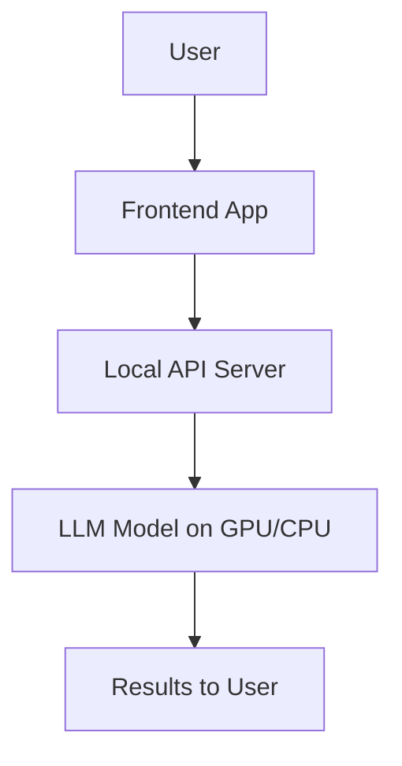
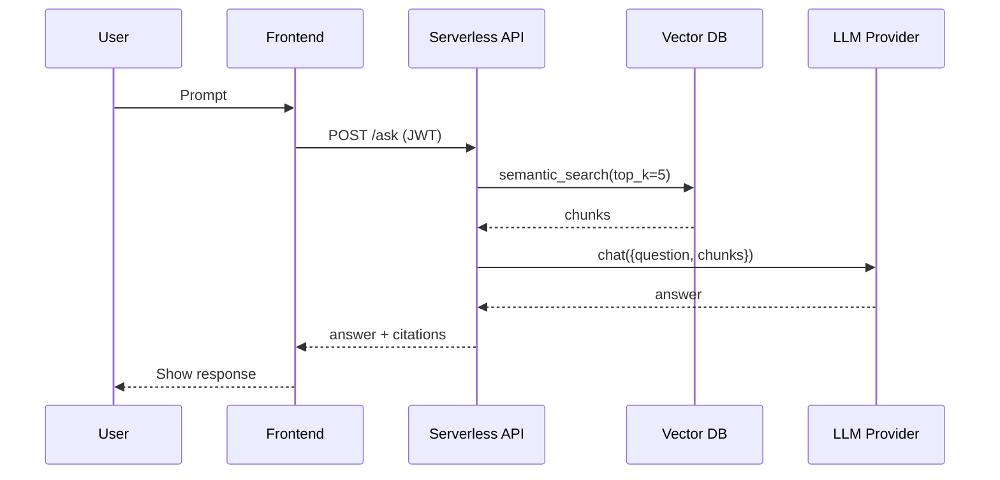

Got it ✅
Here’s a **Markdown (.md) interview prep document** with **layman-friendly, theoretical explanations**, **simple pseudo-code**, and **diagrams (mermaid)** where useful.
This will help you **explain concepts clearly in interviews without going too technical** while still showing strong understanding.

---

# AI Engineer – GPT Specialist Interview Prep

---

## **101. GPT Parameters – Default, Range, Meaning**

When we interact with GPT models, we can tune how the model "thinks" by adjusting key parameters:

### a. Temperature

* **Meaning**: Controls creativity. Higher = more random, lower = more focused.
* **Range**: `0 → 2`
* **Default**: Around `0.7`
* **Analogy**: Like asking 10 people to guess your mood → higher temperature = wild guesses, lower temperature = precise guesses.

```pseudo
if temperature = 0:
    always choose the most likely word
else:
    add randomness proportional to temperature
```

---

### b. Top-k

* **Meaning**: Only consider the top **k most likely words** before picking one.
* **Range**: `1 → 1000`
* **Default**: `50`
* **Analogy**: Instead of choosing from the whole dictionary, restrict to the top `k` best guesses.

---

### c. Top-p (Nucleus Sampling)

* **Meaning**: Instead of fixed number `k`, choose words until their **probability mass ≥ p**.
* **Range**: `0.1 → 1.0`
* **Default**: `1.0`
* **Analogy**: If `p=0.9`, the model only considers words that together make up 90% of likelihood.

---

## **102. Latest GPT Models and Purpose**

| Model       | Purpose                                      |
| ----------- | -------------------------------------------- |
| GPT-4o      | Multimodal (text, image, audio input/output) |
| GPT-4o-mini | Lightweight, cheaper, faster text + vision   |
| GPT-4 Turbo | Optimized for cost + long context            |
| GPT-3.5     | Cheaper text generation (legacy)             |

👉 **Summary**:

* Use **GPT-4o** for cutting-edge multimodal tasks.
* Use **GPT-4o-mini** when speed/cost is priority.
* Use **GPT-4 Turbo** for **long documents + scalability**.
* Use **GPT-3.5** if budget is very tight.

---

## **103. Context Length & Token Limits**

* **Context length** = how much conversation (input + output) the model can remember at once.
* **Token** = \~4 characters in English text.

| Model       | Max Context | Input Tokens | Output Tokens |
| ----------- | ----------- | ------------ | ------------- |
| GPT-4o      | 128k        | up to 128k   | \~4k–8k       |
| GPT-4o-mini | 128k        | up to 128k   | \~4k–8k       |
| GPT-3.5     | 16k–32k     | varies       | \~4k          |

👉 **Rule**: Larger context → higher cost, slower inference.

---

## **104. 3 Ways to Deploy GPT-powered LLMs**

1. **Small Context – API Call**

   * Use OpenAI/HuggingFace API
   * No infra needed, fastest setup
   * Cost: Pay per token

2. **Large Context – Cloud Deployment**

   * Host via AWS Bedrock or Azure OpenAI
   * Handles **long docs (100k+ tokens)**
   * Cost: higher, but scalable

3. **In-house (On-Premise)**

   * Run open-source models (LLaMA, Mistral) locally
   * Cost: GPU hardware upfront, no per-token API bills
   * Use when **data privacy** is critical

---

## **105 & 106. Local GPT System Design (Diagram + Cost)**



* **Infra**:

  * GPU server (e.g., NVIDIA A100)
  * Local database (Postgres)
  * Backend API (Python/Flask/FastAPI)
* **Cost**:

  * GPU server: \$10k–\$15k upfront OR \~\$3/hr cloud rental
  * Free after hardware setup (no per-token cost)

---

## **107. LLaMA vs Claude – Local & Cloud**

```mermaid
flowchart LR
    User -->|Prompt| APIorLocal
    APIorLocal --> ClaudeCloud[Claude (Cloud)]
    APIorLocal --> LLaMALocal[LLaMA (Local GPU)]
```

* **Claude (Anthropic)**

  * **Cloud only** (via API)
  * Cost: \~\$3–15 per million tokens
* **LLaMA (Meta)**

  * **Local possible** if GPU available
  * Cost: Hardware upfront OR HuggingFace hosting

---

## **108. Security Concerns – Local vs Cloud**

* **Local Deployment**

  * All data stays inside company network
  * Needs GPU infra
  * Limitation: expensive, harder scaling

* **Cloud Deployment (GPT, Claude, LLaMA)**

  * Easy scaling
  * Security risk: data leaves network unless **private cloud/VPC**
  * HuggingFace **private inference endpoints** help mitigate

👉 **Limitation**:

* GPT & Claude = cloud only
* LLaMA = can run fully on-prem

---

## **109. HuggingFace Knowledge**

### a. Inference Endpoints

* Run models securely in HuggingFace cloud
* Company data → **does not leave VPC**
* ✅ Solution for secured LLMs without GPUs

### b. HuggingFace API

```pseudo
POST https://api-inference.huggingface.co/models/llama-2
Authorization: Bearer YOUR_API_KEY
{ "inputs": "Hello world" }
```

### c. Local Models

* Download weights from HuggingFace
* Run with libraries like `transformers` or `ollama`

---

## **110. AWS Cloud Infra – 3 Designs**

### Design 1 – Simple (EC2 + RDS + OpenAI API)

* **Infra**: Python backend, Postgres DB, GPT via API
* **Cost**: \$200–500/month
* **Use case**: Startups, small apps

---

### Design 2 – Bedrock-based

* **Infra**: AWS Bedrock for GPT access + Lambda + RDS
* **Cost**: Pay per token, scalable
* **Use case**: Enterprise scale, compliance-friendly

---

### Design 3 – SageMaker LLM Hosting

* **Infra**: Deploy LLaMA/Mistral models in SageMaker
* **Cost**: GPU runtime (\$2–\$10/hr)
* **Use case**: When company wants **control + privacy**

---

## **111. AWS Bedrock Details**

* **Where**: Middle layer between app and LLM
* **Cost**: Pay-as-you-go (per token)
* **Advantage**:

  * No infra mgmt
  * Enterprise security
  * Popular because **multi-model (Anthropic, Cohere, Meta)** in one API

---

## **112. AWS Orchestration**

* **Step Functions**: Automate LLM workflows (multi-step pipelines)
* **SageMaker**: Train/deploy custom models
* **Bedrock**: Ready-made inference API

👉 **Together**:

* Bedrock = inference
* SageMaker = custom training
* Step Functions = orchestration

---

## **113. Simple Ollama**

* **Architecture**: Local LLM runtime (Mac/Linux)

```pseudo
ollama run llama2 "Write a poem about AI"
```

* **Python Call**

```python
import ollama
response = ollama.chat(model="llama2", messages=[{"role":"user","content":"Hello"}])
print(response)
```

* **Uses**: text gen, embeddings, multimodal (if supported)

---

## **114. Simple Claude**

* **Architecture**: API-only (Anthropic cloud)
* **Python Call**

```python
from anthropic import Anthropic
client = Anthropic(api_key="YOUR_KEY")
resp = client.messages.create(model="claude-3-opus", messages=[{"role":"user","content":"Hi"}])
print(resp.content)
```

* **Uses**: Long docs, chatbots, reasoning tasks

---

## **115. Simple GPT**

* **Architecture**: API-only (OpenAI cloud)
* **Python Call**

```python
from openai import OpenAI
client = OpenAI(api_key="YOUR_KEY")
resp = client.chat.completions.create(model="gpt-4o", messages=[{"role":"user","content":"Hi"}])
print(resp.choices[0].message)
```

* **Uses**: Text, multimodal (image/audio input/output)

---

## **116. Basics of Lovable.AI**

* **What**: AI app builder (no-code + low-code)
* **How to Use**: Prompt-driven app creation
* **Cost**: Subscription based (\~\$20–50/month)

---

## **117. Basics of Anthropic**

* **What**: Company behind Claude models
* **How to Use**: API calls (like OpenAI)
* **Cost**: \~\$3–15 per million tokens depending on model

---

## **118. Basics of Perplexity**

* **What**: AI search assistant (ChatGPT + Search)
* **How to Use**: Free + Pro subscription
* **Cost**: Free tier + Pro plan (\$20/month)

---

✅ This prep keeps it **simple, interview-ready, and non-technical enough** for layman explanation but strong enough to show depth.

---

Do you want me to **condense this into a “1-page cheat sheet” PDF** with all diagrams + pseudo code summarized (for quick glance before interview)?


# 106) GPT-Powered LLM in the **Cloud** — Simple System Designs (with Diagrams & Costs)

Below are **three progressively richer cloud designs** you can pitch in an interview. They’re simple, secure-by-default, and easy to explain. Each includes a **Mermaid diagram**, a quick **pseudocode** sketch, and **ballpark costs** with clear assumptions.

---

## A) “Lean & Fast” — **API-only App** (no vector DB)

**When to use:** Chatbot, drafting, Q\&A over short prompts; no private-doc search.
**Pros:** Easiest, fastest to ship. **Cons:** No long-term memory/RAG.

```mermaid
flowchart LR
  U[User Web/Mobile]
  FE[Frontend Static Hosting]
  BE[Backend Cloud Function or Lambda]
  AGW[API Gateway or WAF]
  LLM[LLM Provider API<br/>OpenAI / Claude / Bedrock]
  DB[(RDS or Cloud SQL)]
  OBJ[(Object Storage S3/Blob)]

  U -->|HTTPS| FE
  FE -->|REST/GraphQL| BE
  BE -->|AuthN + Rate Limit| AGW
  BE -->|LLM request (tokens)| LLM
  BE -->|Store chats| DB
  BE -->|Store files| OBJ

```

**Pseudocode (Cloud Function):**

```pseudo
handler(request):
  user = auth.verify(request.headers)
  text = request.body.prompt
  response = llm.chat(model="gpt-4o", messages=[{"role":"user","content":text}])
  db.save(user.id, text, response)
  return response
```

**Ballpark Cost / Month (indicative):**

* **LLM usage:** Depends on tokens. See formula below.
* **Backend (serverless):** \$10–\$50 (API Gateway + Functions at low traffic)
* **DB (RDS/Cloud SQL small):** \$30–\$100
* **Object Storage:** \$1–\$10 (light usage)
* **Total (light)**: **\$50–\$250 + LLM tokens**

**Token Cost Formula (generic):**

```
Monthly_LLM_Cost ≈ (Input_Tokens * $/M_in) + (Output_Tokens * $/M_out)
Example Workload:
  100k requests/month
  avg 800 input + 200 output tokens
  => Input = 80M tokens, Output = 20M tokens

If unit prices were (illustrative):
  $/M_in = $3, $/M_out = $15
Then:
  Cost ≈ (80 * 3) + (20 * 15) = $240 + $300 = $540
```

> Use **your provider’s current price sheet** in production; above is interview-friendly math.

---

## B) “RAG-Ready” — **Search over Your Docs** (Vector DB + Embeddings)

**When to use:** Internal knowledge bots, policy Q\&A, support copilots.
**Pros:** Answers grounded in your content. **Cons:** Slightly more moving parts.

```mermaid
flowchart TD
    A[User] --> B[Frontend]
    B --> C[Backend API]
    C -->|Auth + WAF| G[API Gateway]
    C -->|Query| VDB[(Vector DB\n(Pinecone/Opensearch/PgVector))]
    C -->|Get Chunks| STOR[(S3/Blob Storage)]
    C -->|RAG Prompt (context)| LLM[(LLM Provider API)]
    subgraph Ingestion Pipeline
      U1[Docs: PDFs, HTML, Confluence] --> E1[ETL/Chunk]
      E1 --> EM[Embedder API\n(Bedrock/Hosted/Local)]
      EM --> VDB
      E1 --> STOR
    end
```

**RAG Pseudocode (Backend):**

```pseudo
answer(question, user_id):
  chunks = vdb.search(embedding(question), top_k=5)
  prompt = build_prompt(question, chunks)  // cite sources
  reply = llm.chat(model="gpt-4o", messages=[{"role":"user","content":prompt}])
  return reply
```

**Ballpark Cost / Month (indicative):**

* **LLM usage:** As per formula (often **lower output** due to focused context).
* **Embeddings:**

  * 10k new pages @ avg 1.5k tokens/page → 15M tokens to embed
  * If \$0.05/M tokens: **\~\$750 one-time** (then incremental)
* **Vector DB:**

  * **Hosted** (Pinecone small prod): \$70–\$400+
  * **Managed OpenSearch** small: \$100–\$300
* **Pipeline compute (serverless/containers):** \$20–\$100
* **Total (steady state, light ingest):** **\$200–\$900 + LLM tokens**

> Tip: For small teams, **pgvector on RDS** keeps cost down. For scale, Pinecone/Bedrock KB/OpenSearch.

---

## C) “Enterprise-Grade” — **Private/VPC + Bedrock (or Azure OpenAI)**

**When to use:** Privacy, compliance, audit, network isolation, **no data leaves VPC**.
**Pros:** Strong security posture. **Cons:** Higher base cost, vendor lock-in.

```mermaid
flowchart LR
    U[User (VPN/SSO)] --> FE[Frontend (ALB + WAF)]
    FE --> BE[ECS/EKS/Serverless API]
    BE --> SEC[Secrets Manager/KMS]
    BE --> LLM[Bedrock/Azure OpenAI (Private Link/VNet)]
    BE --> VDB[(Vector DB in VPC\n(OpenSearch/pgvector))]
    BE --> RDS[(RDS/CloudSQL)]
    BE --> S3[(S3 Private Bucket)]
    MON[CloudWatch/Logs] --> SEC
    BE --> MON
```

**RAG + Guardrail Pseudocode (Orchestrated):**

```pseudo
handle(question):
  pii_checked = guardrails.detect_pii(question)
  if pii_checked.block: return "Blocked by policy"
  chunks = vdb.search(embedding(question), top_k=5, filter=tenant_scope)
  prompt = compose(system_policies, question, chunks)
  resp = bedrock.chat(model="anthropic.claude-3", messages=[{"role":"user","content":prompt}])
  audit.log(user, question, chunk_ids, resp)
  return resp
```

**Ballpark Cost / Month (indicative):**

* **VPC endpoints/Private Link:** \$20–\$80
* **Bedrock/Azure OpenAI:** per-token (same formula; **enterprise SKUs** may differ)
* **OpenSearch/Vector:** \$150–\$600 (prod small)
* **App compute (ECS/EKS/Lambda):** \$50–\$300
* **Observability (logs, traces):** \$10–\$100
* **Total (light)**: **\$250–\$1.2k + LLM tokens**

> Interview sound-bite: *“We keep traffic inside the VPC using PrivateLink/VNet, encrypt with KMS, enforce SSO, and log prompts/completions for audit.”*

---

## Quick **Feature Matrix** (what each design buys you)

| Capability              | A) API-only | B) RAG-Ready | C) Enterprise/VPC |
| ----------------------- | ----------- | ------------ | ----------------- |
| Time-to-ship            | **Hours**   | Days         | Weeks             |
| Search your docs (RAG)  | ❌           | **✅**        | **✅**             |
| Data stays in your VPC  | ❌           | ◑ (possible) | **✅**             |
| Multi-tenant readiness  | ◑           | ✅            | **✅**             |
| Compliance (audit, SSO) | ◑           | ✅            | **✅**             |
| Lowest infra cost       | **✅**       | ◑            | ❌                 |
| Easiest to scale        | ✅           | ✅            | ✅                 |

◑ = achievable with some extra work.

---

## Cost **Cheat-Sheet** You Can Say Out Loud

* “**Tokens dominate** cost; infra is secondary at low scale.”
* “**RAG saves tokens** by narrowing context to relevant chunks.”
* “**Enterprise security** adds VPC, PrivateLink, and logging — **more base cost, less risk**.”
* “We start with **A**, add **RAG** (B) when we need grounded answers, and go **C** for **regulated data**.”

---

## Bonus: **Serverless Sequence** (how a single request flows)



---

### One-Screen Answer If They Ask “So… how much will it cost?”

* **Prototype (A)**: **\$50–\$250 + tokens**
* **Knowledge bot (B)**: **\$200–\$900 + tokens**
* **Enterprise (C)**: **\$250–\$1.2k + tokens**

> Then compute tokens with the **formula** using your expected traffic.

---

If you want, I can adapt these diagrams to **AWS**, **Azure**, or **GCP** notation and attach **ready-to-present slides**.
