# GURU_GPT - Low Level Design Document

## Table of Contents
1. [System Overview](#system-overview)
2. [Core Architecture](#core-architecture)
3. [Component Diagrams](#component-diagrams)
4. [Module Details](#module-details)
5. [Data Flow Diagrams](#data-flow-diagrams)
6. [API Interfaces](#api-interfaces)
7. [Database Schema](#database-schema)
8. [Error Handling](#error-handling)
9. [Performance Considerations](#performance-considerations)

---

## System Overview

GURU_GPT is a comprehensive AI-powered chat assistant built with Streamlit, featuring advanced prompt engineering, PDF processing, AI agents, and MCP (Model Context Protocol) server capabilities.

### Key Features
- **Multi-Model GPT Support**: GPT-4o, GPT-4o Mini, GPT-4 Turbo
- **PDF Context Processing**: Upload and process PDFs for contextual responses
- **Prompt Engineering Lab**: Advanced prompt testing and optimization
- **AI Agent System**: Weather and news fetching with AI summarization
- **MCP Server**: Model Context Protocol implementation for tool integration
- **Response Evaluation**: Comprehensive quality metrics and analysis

---

## Core Architecture

### High-Level System Architecture
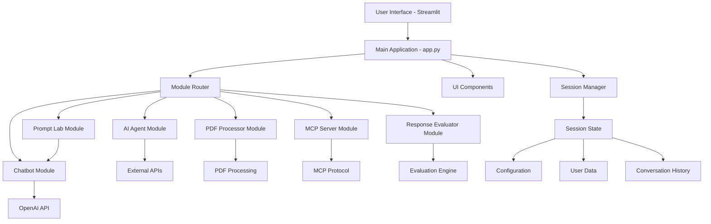
```mermaid
graph TB
    A[User Interface - Streamlit] --> B[Main Application - app.py]
    B --> C[Session Manager]
    B --> D[UI Components]
    B --> E[Module Router]
    
    E --> F[Chatbot Module]
    E --> G[Prompt Lab Module]
    E --> H[AI Agent Module]
    E --> I[PDF Processor Module]
    E --> J[MCP Server Module]
    E --> K[Response Evaluator Module]
    
    F --> L[OpenAI API]
    G --> F
    H --> M[External APIs]
    I --> N[PDF Processing]
    J --> O[MCP Protocol]
    K --> P[Evaluation Engine]
    
    C --> Q[Session State]
    Q --> R[Configuration]
    Q --> S[User Data]
    Q --> T[Conversation History]
```

---

## Component Diagrams

### 1. Main Application (app.py)

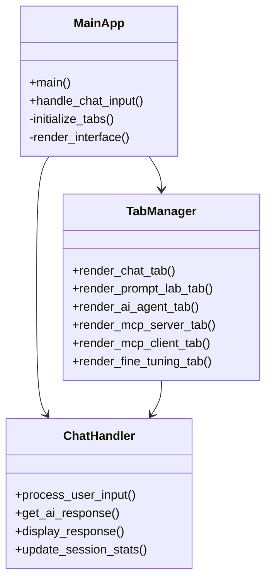
```mermaid
classDiagram
    class MainApp {
        +main()
        +handle_chat_input()
        -initialize_tabs()
        -render_interface()
    }
    
    class TabManager {
        +render_chat_tab()
        +render_prompt_lab_tab()
        +render_ai_agent_tab()
        +render_mcp_server_tab()
        +render_mcp_client_tab()
        +render_fine_tuning_tab()
    }
    
    class ChatHandler {
        +process_user_input()
        +get_ai_response()
        +display_response()
        +update_session_stats()
    }
    
    MainApp --> TabManager
    MainApp --> ChatHandler
    TabManager --> ChatHandler
```

### 2. Chatbot Module (chatbot.py)

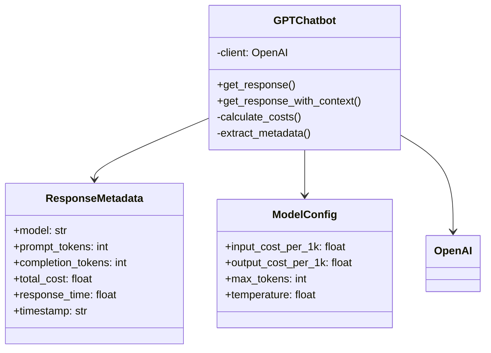
```mermaid
classDiagram
    class GPTChatbot {
        -client: OpenAI
        +get_response()
        +get_response_with_context()
        -calculate_costs()
        -extract_metadata()
    }
    
    class ResponseMetadata {
        +model: str
        +prompt_tokens: int
        +completion_tokens: int
        +total_cost: float
        +response_time: float
        +timestamp: str
    }
    
    class ModelConfig {
        +input_cost_per_1k: float
        +output_cost_per_1k: float
        +max_tokens: int
        +temperature: float
    }
    
    GPTChatbot --> ResponseMetadata
    GPTChatbot --> ModelConfig
    GPTChatbot --> OpenAI
```

### 3. Prompt Lab Module (prompt_lab.py)

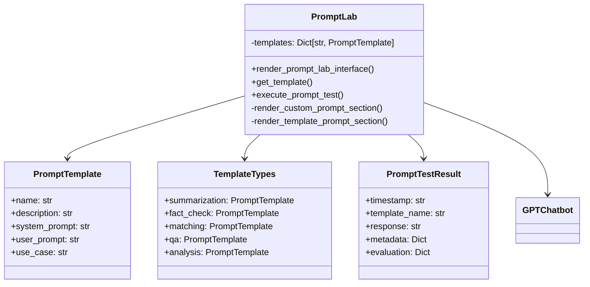
```mermaid
classDiagram
    class PromptLab {
        -templates: Dict[str, PromptTemplate]
        +render_prompt_lab_interface()
        +get_template()
        +execute_prompt_test()
        -render_custom_prompt_section()
        -render_template_prompt_section()
    }
    
    class PromptTemplate {
        +name: str
        +description: str
        +system_prompt: str
        +user_prompt: str
        +use_case: str
    }
    
    class TemplateTypes {
        +summarization: PromptTemplate
        +fact_check: PromptTemplate
        +matching: PromptTemplate
        +qa: PromptTemplate
        +analysis: PromptTemplate
    }
    
    class PromptTestResult {
        +timestamp: str
        +template_name: str
        +response: str
        +metadata: Dict
        +evaluation: Dict
    }
    
    PromptLab --> PromptTemplate
    PromptLab --> TemplateTypes
    PromptLab --> PromptTestResult
    PromptLab --> GPTChatbot
```

### 4. AI Agent Module (ai_agent.py)

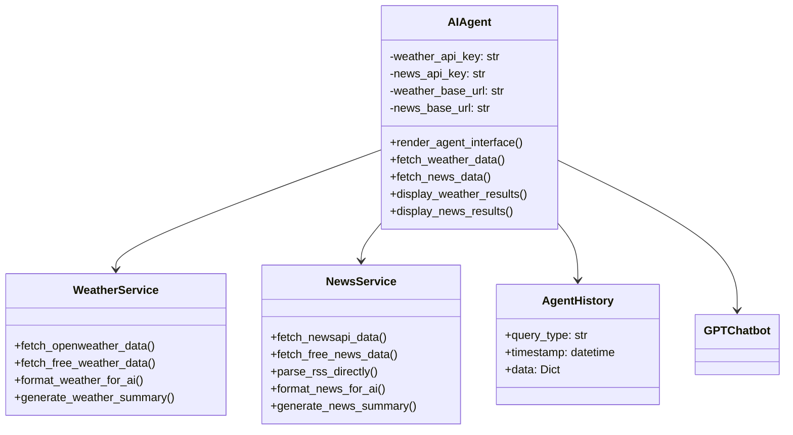
```mermaid
classDiagram
    class AIAgent {
        -weather_api_key: str
        -news_api_key: str
        -weather_base_url: str
        -news_base_url: str
        +render_agent_interface()
        +fetch_weather_data()
        +fetch_news_data()
        +display_weather_results()
        +display_news_results()
    }
    
    class WeatherService {
        +fetch_openweather_data()
        +fetch_free_weather_data()
        +format_weather_for_ai()
        +generate_weather_summary()
    }
    
    class NewsService {
        +fetch_newsapi_data()
        +fetch_free_news_data()
        +parse_rss_directly()
        +format_news_for_ai()
        +generate_news_summary()
    }
    
    class AgentHistory {
        +query_type: str
        +timestamp: datetime
        +data: Dict
    }
    
    AIAgent --> WeatherService
    AIAgent --> NewsService
    AIAgent --> AgentHistory
    AIAgent --> GPTChatbot
```

### 5. PDF Processor Module (pdf_processor.py)

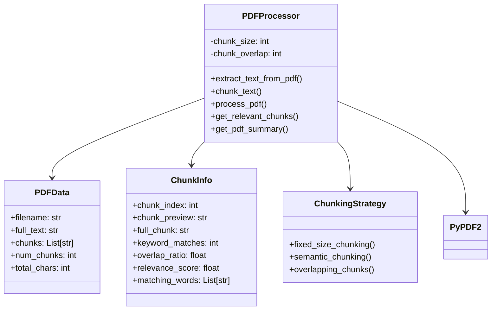
```mermaid
classDiagram
    class PDFProcessor {
        -chunk_size: int
        -chunk_overlap: int
        +extract_text_from_pdf()
        +chunk_text()
        +process_pdf()
        +get_relevant_chunks()
        +get_pdf_summary()
    }
    
    class PDFData {
        +filename: str
        +full_text: str
        +chunks: List[str]
        +num_chunks: int
        +total_chars: int
    }
    
    class ChunkInfo {
        +chunk_index: int
        +chunk_preview: str
        +full_chunk: str
        +keyword_matches: int
        +overlap_ratio: float
        +relevance_score: float
        +matching_words: List[str]
    }
    
    class ChunkingStrategy {
        +fixed_size_chunking()
        +semantic_chunking()
        +overlapping_chunks()
    }
    
    PDFProcessor --> PDFData
    PDFProcessor --> ChunkInfo
    PDFProcessor --> ChunkingStrategy
    PDFProcessor --> PyPDF2
```

### 6. MCP Server Module (mcp_server.py)

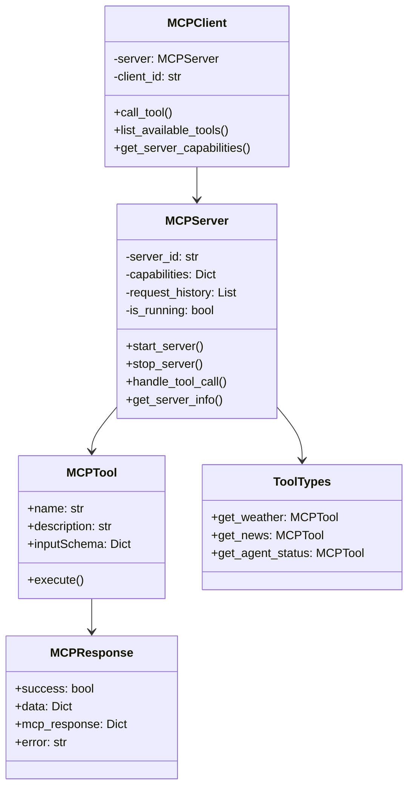
```mermaid
classDiagram
    class MCPServer {
        -server_id: str
        -capabilities: Dict
        -request_history: List
        -is_running: bool
        +start_server()
        +stop_server()
        +handle_tool_call()
        +get_server_info()
    }
    
    class MCPClient {
        -server: MCPServer
        -client_id: str
        +call_tool()
        +list_available_tools()
        +get_server_capabilities()
    }
    
    class MCPTool {
        +name: str
        +description: str
        +inputSchema: Dict
        +execute()
    }
    
    class ToolTypes {
        +get_weather: MCPTool
        +get_news: MCPTool
        +get_agent_status: MCPTool
    }
    
    class MCPResponse {
        +success: bool
        +data: Dict
        +mcp_response: Dict
        +error: str
    }
    
    MCPServer --> MCPTool
    MCPServer --> ToolTypes
    MCPClient --> MCPServer
    MCPTool --> MCPResponse
```

### 7. Response Evaluator Module (response_evaluator.py)

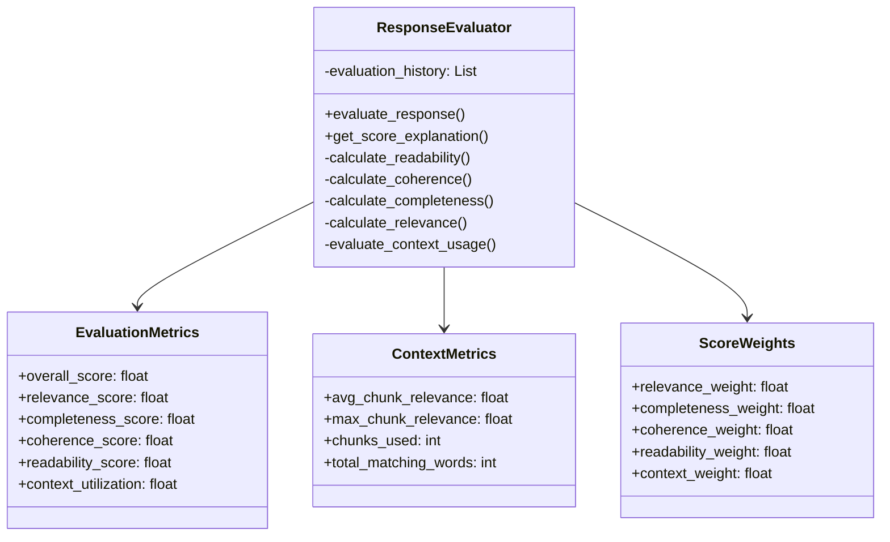
```mermaid
classDiagram
    class ResponseEvaluator {
        -evaluation_history: List
        +evaluate_response()
        +get_score_explanation()
        -calculate_readability()
        -calculate_coherence()
        -calculate_completeness()
        -calculate_relevance()
        -evaluate_context_usage()
    }
    
    class EvaluationMetrics {
        +overall_score: float
        +relevance_score: float
        +completeness_score: float
        +coherence_score: float
        +readability_score: float
        +context_utilization: float
    }
    
    class ContextMetrics {
        +avg_chunk_relevance: float
        +max_chunk_relevance: float
        +chunks_used: int
        +total_matching_words: int
    }
    
    class ScoreWeights {
        +relevance_weight: float
        +completeness_weight: float
        +coherence_weight: float
        +readability_weight: float
        +context_weight: float
    }
    
    ResponseEvaluator --> EvaluationMetrics
    ResponseEvaluator --> ContextMetrics
    ResponseEvaluator --> ScoreWeights
```

### 8. UI Components Module (ui_components.py)

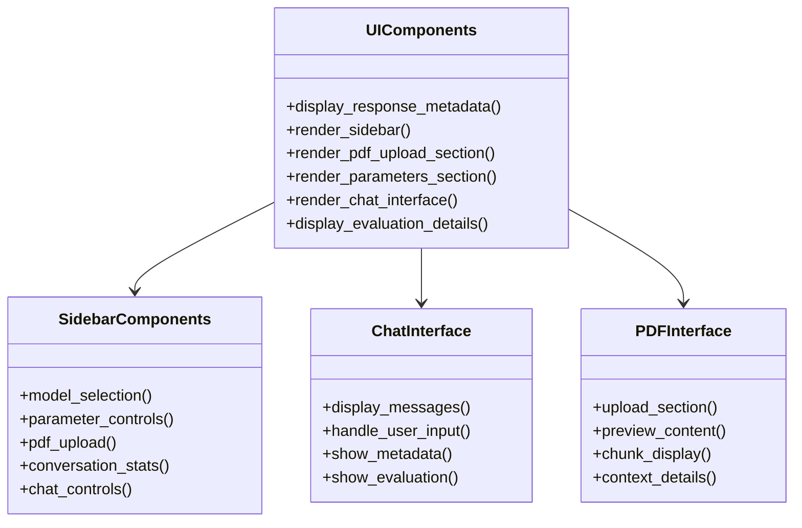
```mermaid
classDiagram
    class UIComponents {
        +display_response_metadata()
        +render_sidebar()
        +render_pdf_upload_section()
        +render_parameters_section()
        +render_chat_interface()
        +display_evaluation_details()
    }
    
    class SidebarComponents {
        +model_selection()
        +parameter_controls()
        +pdf_upload()
        +conversation_stats()
        +chat_controls()
    }
    
    class ChatInterface {
        +display_messages()
        +handle_user_input()
        +show_metadata()
        +show_evaluation()
    }
    
    class PDFInterface {
        +upload_section()
        +preview_content()
        +chunk_display()
        +context_details()
    }
    
    UIComponents --> SidebarComponents
    UIComponents --> ChatInterface
    UIComponents --> PDFInterface
```

### 9. Session Manager (session_manager.py)

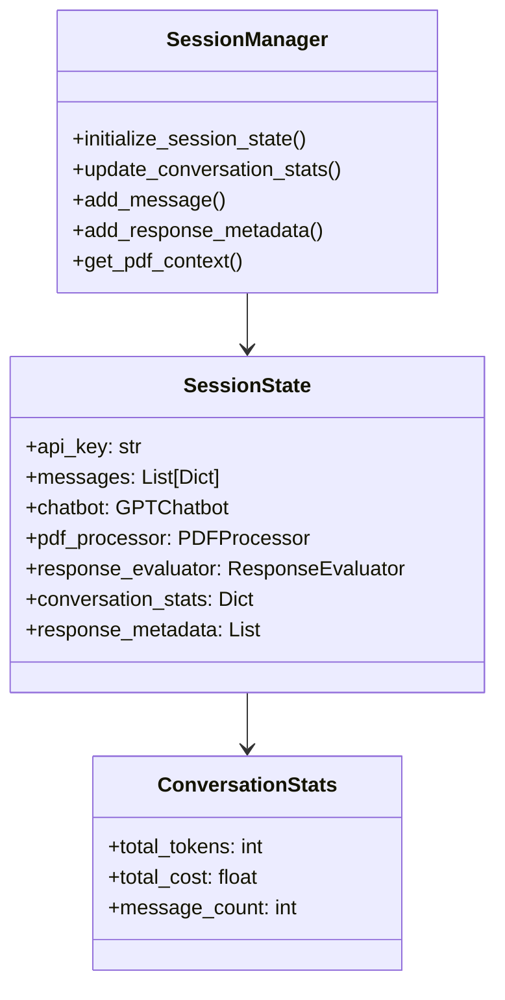
```mermaid
classDiagram
    class SessionManager {
        +initialize_session_state()
        +update_conversation_stats()
        +add_message()
        +add_response_metadata()
        +get_pdf_context()
    }
    
    class SessionState {
        +api_key: str
        +messages: List[Dict]
        +chatbot: GPTChatbot
        +pdf_processor: PDFProcessor
        +response_evaluator: ResponseEvaluator
        +conversation_stats: Dict
        +response_metadata: List
    }
    
    class ConversationStats {
        +total_tokens: int
        +total_cost: float
        +message_count: int
    }
    
    SessionManager --> SessionState
    SessionState --> ConversationStats
```

---

## Data Flow Diagrams

### 1. Chat Flow Diagram

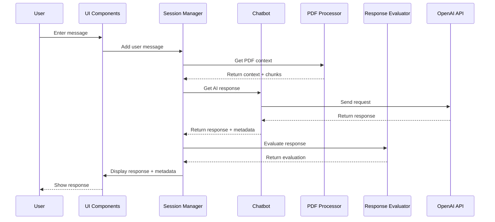
```mermaid
sequenceDiagram
    participant U as User
    participant UI as UI Components
    participant SM as Session Manager
    participant CB as Chatbot
    participant PE as PDF Processor
    participant RE as Response Evaluator
    participant API as OpenAI API
    
    U->>UI: Enter message
    UI->>SM: Add user message
    SM->>PE: Get PDF context
    PE-->>SM: Return context + chunks
    SM->>CB: Get AI response
    CB->>API: Send request
    API-->>CB: Return response
    CB-->>SM: Return response + metadata
    SM->>RE: Evaluate response
    RE-->>SM: Return evaluation
    SM->>UI: Display response + metadata
    UI-->>U: Show response
```

### 2. PDF Processing Flow

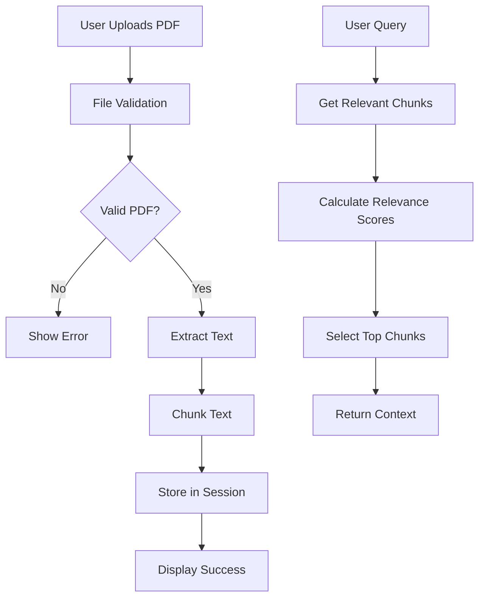
```mermaid
flowchart TD
    A[User Uploads PDF] --> B[File Validation]
    B --> C{Valid PDF?}
    C -->|No| D[Show Error]
    C -->|Yes| E[Extract Text]
    E --> F[Chunk Text]
    F --> G[Store in Session]
    G --> H[Display Success]
    
    I[User Query] --> J[Get Relevant Chunks]
    J --> K[Calculate Relevance Scores]
    K --> L[Select Top Chunks]
    L --> M[Return Context]
```

### 3. Prompt Lab Flow

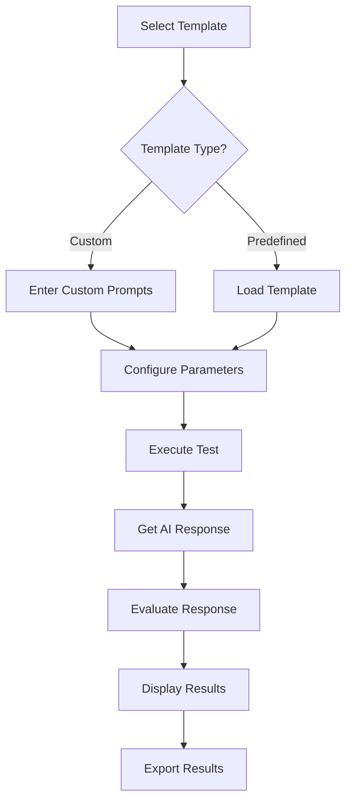
```mermaid
flowchart TD
    A[Select Template] --> B{Template Type?}
    B -->|Custom| C[Enter Custom Prompts]
    B -->|Predefined| D[Load Template]
    C --> E[Configure Parameters]
    D --> E
    E --> F[Execute Test]
    F --> G[Get AI Response]
    G --> H[Evaluate Response]
    H --> I[Display Results]
    I --> J[Export Results]
```

### 4. AI Agent Flow

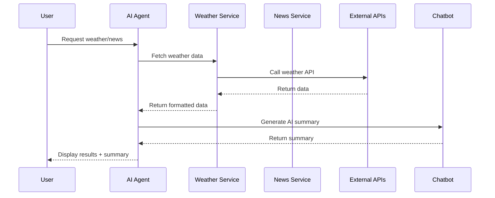
```mermaid
sequenceDiagram
    participant U as User
    participant AI as AI Agent
    participant WS as Weather Service
    participant NS as News Service
    participant API as External APIs
    participant CB as Chatbot
    
    U->>AI: Request weather/news
    AI->>WS: Fetch weather data
    WS->>API: Call weather API
    API-->>WS: Return data
    WS-->>AI: Return formatted data
    AI->>CB: Generate AI summary
    CB-->>AI: Return summary
    AI-->>U: Display results + summary
```

### 5. MCP Server Flow

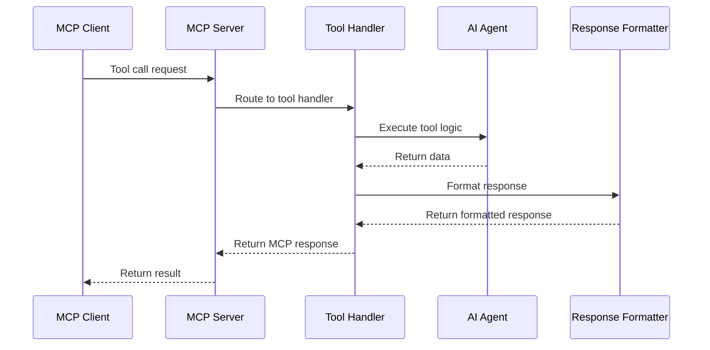
```mermaid
sequenceDiagram
    participant C as MCP Client
    participant S as MCP Server
    participant T as Tool Handler
    participant A as AI Agent
    participant R as Response Formatter
    
    C->>S: Tool call request
    S->>T: Route to tool handler
    T->>A: Execute tool logic
    A-->>T: Return data
    T->>R: Format response
    R-->>T: Return formatted response
    T-->>S: Return MCP response
    S-->>C: Return result
```

---

## API Interfaces

### 1. OpenAI API Integration

```python
# GPT Chatbot API Interface
class GPTChatbot:
    def get_response(self, messages, model, **parameters):
        """
        Parameters:
        - messages: List[Dict[str, str]] - Conversation messages
        - model: str - GPT model name
        - temperature: float - Response randomness (0.0-2.0)
        - max_tokens: int - Maximum response length
        - top_p: float - Nucleus sampling (0.0-1.0)
        - frequency_penalty: float - Repetition penalty (-2.0 to 2.0)
        - presence_penalty: float - Topic diversity (-2.0 to 2.0)
        
        Returns:
        - Tuple[str, Dict] - Response content and metadata
        """
```

### 2. PDF Processing Interface

```python
# PDF Processor API Interface
class PDFProcessor:
    def process_pdf(self, uploaded_file):
        """
        Parameters:
        - uploaded_file: UploadedFile - Streamlit file upload object
        
        Returns:
        - Dict - PDF data with chunks and metadata
        """
    
    def get_relevant_chunks(self, chunks, query, max_chunks=3):
        """
        Parameters:
        - chunks: List[str] - Text chunks
        - query: str - Search query
        - max_chunks: int - Maximum chunks to return
        
        Returns:
        - Tuple[str, List[Dict]] - Context text and chunk info
        """
```

### 3. MCP Server Interface

```python
# MCP Server API Interface
class MCPServer:
    def handle_tool_call(self, tool_name, parameters):
        """
        Parameters:
        - tool_name: str - Name of the tool to call
        - parameters: Dict - Tool parameters
        
        Returns:
        - Dict - MCP response with success status and data
        """
    
    def get_server_info(self):
        """
        Returns:
        - Dict - Server status and capabilities
        """
```

---

## Database Schema

### Session State Schema

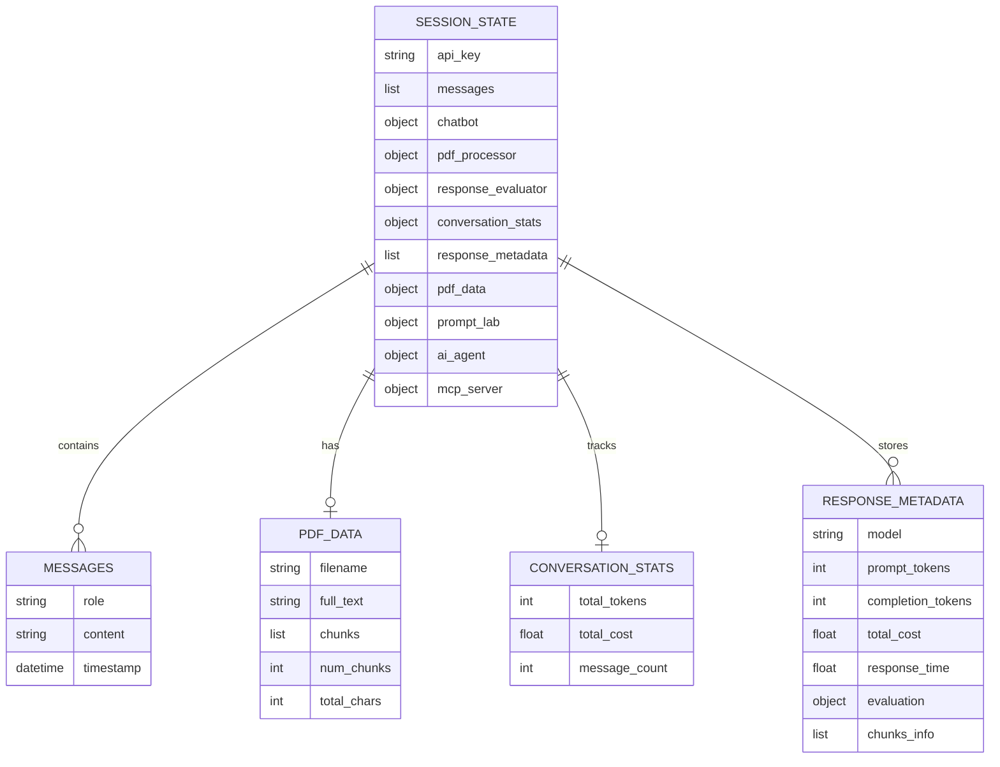
```mermaid
erDiagram
    SESSION_STATE {
        string api_key
        list messages
        object chatbot
        object pdf_processor
        object response_evaluator
        object conversation_stats
        list response_metadata
        object pdf_data
        object prompt_lab
        object ai_agent
        object mcp_server
    }
    
    MESSAGES {
        string role
        string content
        datetime timestamp
    }
    
    PDF_DATA {
        string filename
        string full_text
        list chunks
        int num_chunks
        int total_chars
    }
    
    CONVERSATION_STATS {
        int total_tokens
        float total_cost
        int message_count
    }
    
    RESPONSE_METADATA {
        string model
        int prompt_tokens
        int completion_tokens
        float total_cost
        float response_time
        object evaluation
        list chunks_info
    }
    
    SESSION_STATE ||--o{ MESSAGES : contains
    SESSION_STATE ||--o| PDF_DATA : has
    SESSION_STATE ||--o| CONVERSATION_STATS : tracks
    SESSION_STATE ||--o{ RESPONSE_METADATA : stores
```

---

## Error Handling

### Error Handling Strategy

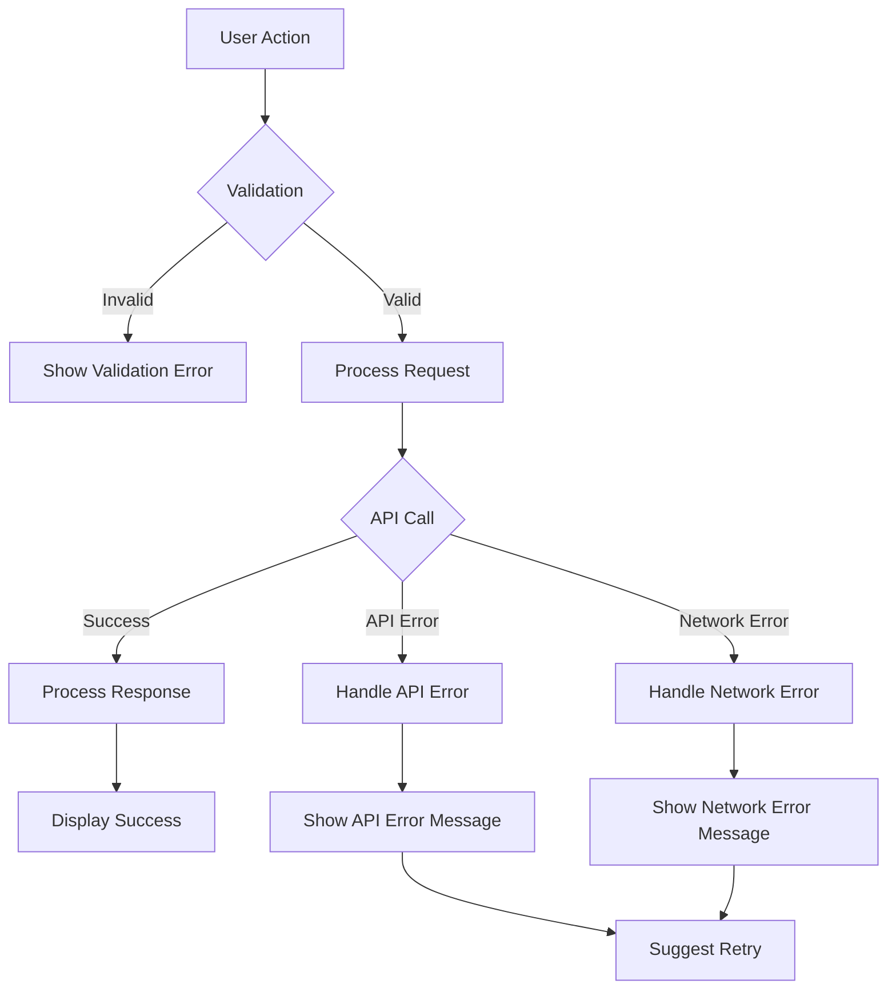
```mermaid
flowchart TD
    A[User Action] --> B{Validation}
    B -->|Invalid| C[Show Validation Error]
    B -->|Valid| D[Process Request]
    D --> E{API Call}
    E -->|Success| F[Process Response]
    E -->|API Error| G[Handle API Error]
    E -->|Network Error| H[Handle Network Error]
    F --> I[Display Success]
    G --> J[Show API Error Message]
    H --> K[Show Network Error Message]
    J --> L[Suggest Retry]
    K --> L
```

### Error Types and Handling

1. **API Errors**
   - Invalid API key
   - Rate limiting
   - Model unavailable
   - Token limit exceeded

2. **File Processing Errors**
   - Invalid file format
   - File too large
   - Corrupted PDF
   - Text extraction failure

3. **Network Errors**
   - Connection timeout
   - Service unavailable
   - DNS resolution failure

4. **Validation Errors**
   - Missing required parameters
   - Invalid parameter values
   - Empty input fields

---

## Performance Considerations

### 1. Caching Strategy

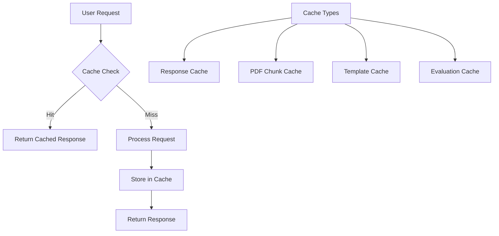
```mermaid
graph TB
    A[User Request] --> B{Cache Check}
    B -->|Hit| C[Return Cached Response]
    B -->|Miss| D[Process Request]
    D --> E[Store in Cache]
    E --> F[Return Response]
    
    G[Cache Types] --> H[Response Cache]
    G --> I[PDF Chunk Cache]
    G --> J[Template Cache]
    G --> K[Evaluation Cache]
```

### 2. Memory Management

- **Session State**: Limited to essential data only
- **PDF Processing**: Chunked processing for large files
- **Response History**: Limited to recent responses
- **Cache Cleanup**: Automatic cleanup of old data

### 3. API Optimization

- **Batch Processing**: Multiple requests in single API call
- **Token Optimization**: Efficient prompt construction
- **Model Selection**: Appropriate model for task complexity
- **Rate Limiting**: Respect API rate limits

### 4. UI Performance

- **Lazy Loading**: Load components on demand
- **Streaming**: Real-time response display
- **Debouncing**: Reduce unnecessary API calls
- **Caching**: Cache UI state and data

---

## Security Considerations

### 1. API Key Security
- Environment variable storage
- No hardcoded keys
- Secure transmission

### 2. Data Privacy
- No persistent storage of user data
- Session-based data only
- PDF processing in memory

### 3. Input Validation
- File type validation
- Size limits
- Content sanitization

### 4. Error Information
- No sensitive data in error messages
- Generic error responses
- Logging without user data

---

## Deployment Architecture

### Local Development
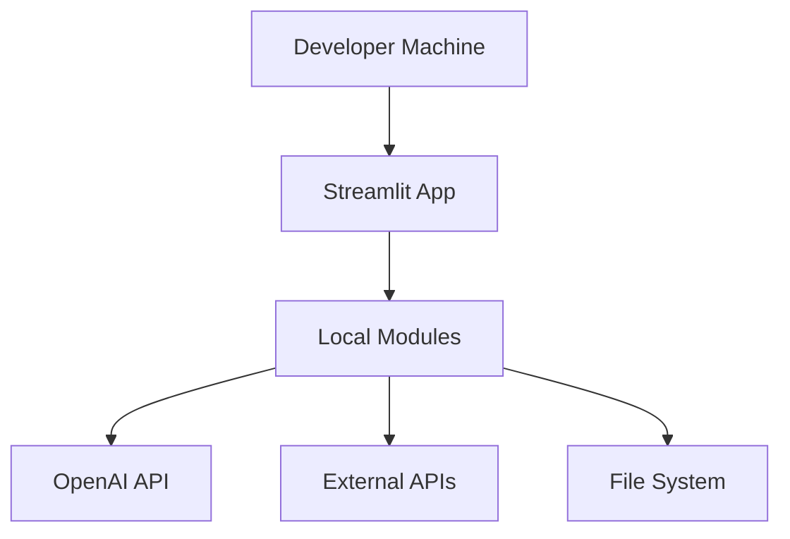
```mermaid
graph TB
    A[Developer Machine] --> B[Streamlit App]
    B --> C[Local Modules]
    C --> D[OpenAI API]
    C --> E[External APIs]
    C --> F[File System]
```

### Production Deployment
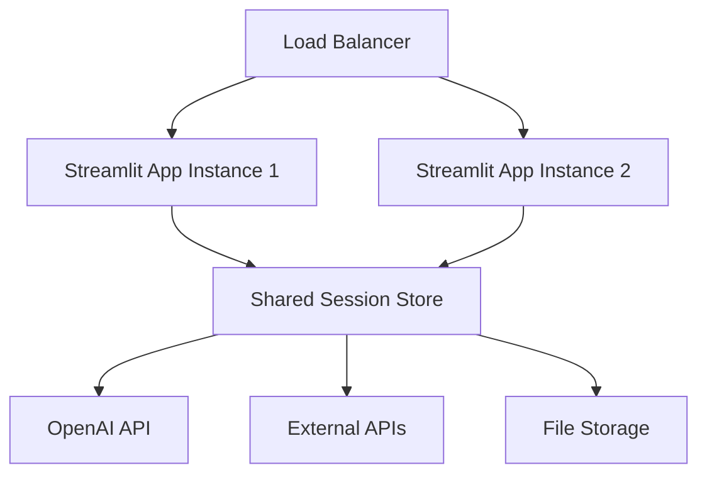
```mermaid
graph TB
    A[Load Balancer] --> B[Streamlit App Instance 1]
    A --> C[Streamlit App Instance 2]
    B --> D[Shared Session Store]
    C --> D
    D --> E[OpenAI API]
    D --> F[External APIs]
    D --> G[File Storage]
```

---

## Monitoring and Logging

### 1. Application Metrics
- Response times
- Token usage
- Error rates
- User interactions

### 2. Performance Metrics
- Memory usage
- CPU utilization
- API call frequency
- Cache hit rates

### 3. Business Metrics
- User engagement
- Feature usage
- Cost tracking
- Quality scores

---

## Future Enhancements

### 1. Planned Features
- Multi-language support
- Advanced PDF processing
- Custom model fine-tuning
- Real-time collaboration

### 2. Architecture Improvements
- Microservices architecture
- Database integration
- Advanced caching
- Horizontal scaling

### 3. AI Enhancements
- Custom model training
- Advanced prompt optimization
- Multi-modal support
- Real-time learning

---

This Low-Level Design document provides a comprehensive view of the GURU_GPT system architecture, component interactions, and implementation details. The diagrams and specifications serve as a blueprint for development, maintenance, and future enhancements.
